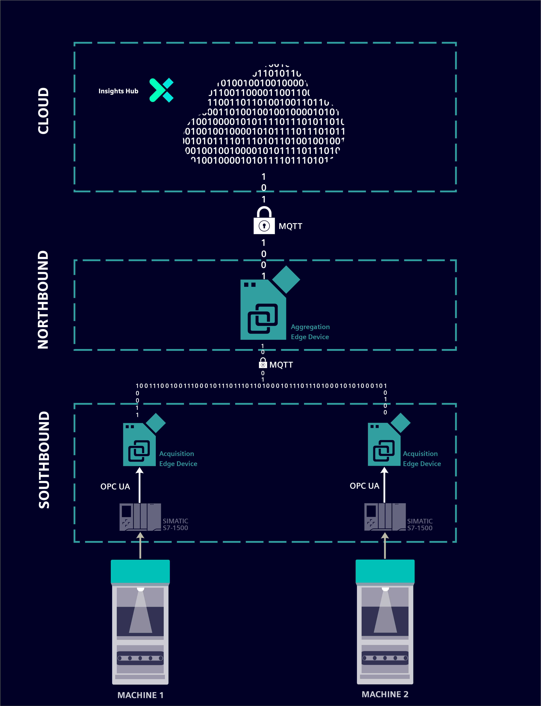
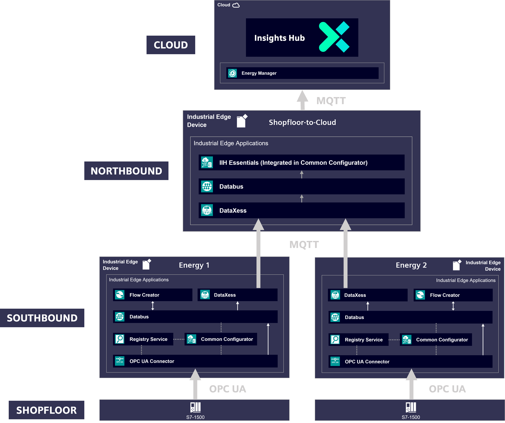
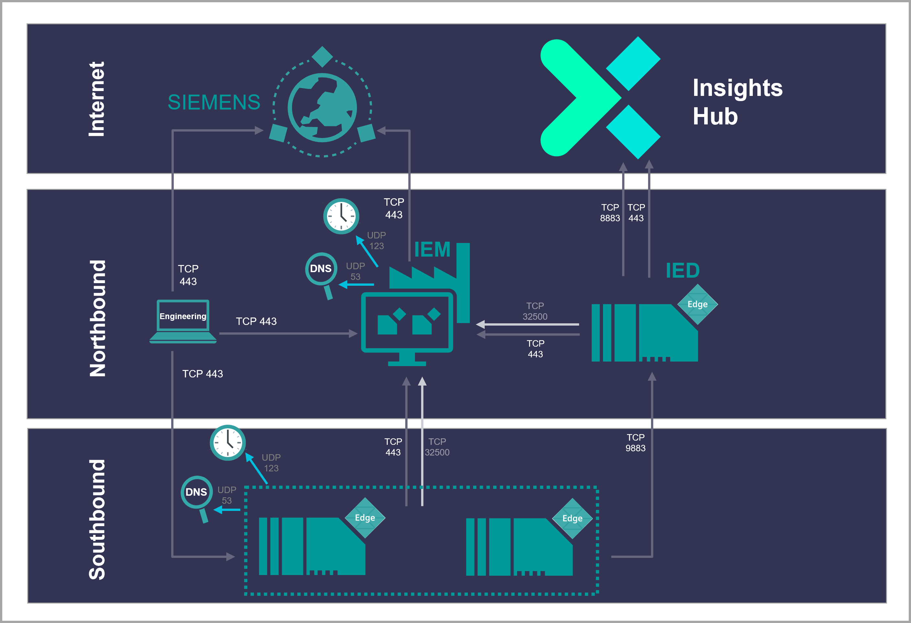

# Shopfloor to Cloud Connectivity - Integrate machine & production data securely into the company cloud

Use case for communication from Edge Device to Edge Device and company Cloud (e.g. Insights Hub, formerly known as MindSphere) via MQTT 

- [Shopfloor to Cloud Connectivity - Integrate machine \& production data securely into the company cloud](#shopfloor-to-cloud-connectivity---integrate-machine--production-data-securely-into-the-company-cloud)
  - [Overview](#overview)
    - [Reference Architecture](#reference-architecture)
    - [Network Architecture](#network-architecture)
  - [General task](#general-task)
  - [Requirements](#requirements)
    - [Prerequisites](#prerequisites)
    - [Used components](#used-components)
  - [Configuration Southbound Devices](#configuration-southbound-devices)
  - [Configuration Northbound Device](#configuration-northbound-device)
  - [Configuration Insights Hub](#configuration-insights-hub)
  - [Documentation](#documentation)
  - [Contribution](#contribution)
  - [Licence and Legal Information](#licence-and-legal-information)

## Overview

The following image represents the data flow that will be achieved in this example, which covers everything from the acquisition of data from a machine in full production to its storage and processing in the cloud in general:

### Reference Architecture 

This representation visualizes how data moves across edge applications within edge devices. The specific configurations of these applications will be detailed in this repository:

### Network Architecture

The following image illustrates the interaction and communication between all the devices used:

## General task

Gathering of energy data from various controllers and converting it to a standardized form in a southbound Edge Device with no internet access. 

Central monitoring of energy data from multiple locations in dashboards, with a strict separation between Automation Cell Network (Southbound) and Datacenter (Northbound). Because there is no direct connection between Southbound and the connected PLCs with the Internet, this guideline minimizes security risks.

Sharing the standardized data with a northbound Edge Device, with internet connectivity.

Structuring the energy data in asset models according to the asset design in Insights Hub in the northbound Edge Device and forwarding them to Insights Hub.

## Requirements

###  Prerequisites
- Industrial Edge Learning Path (Module 1-3)
- Established connection to 2 PLCs to acquire data with the Edge Device
- Access to an Industrial Edge Management System (IEM)
- Onboarded 3 Industrial Edge Devices (IEDs) on Industrial Edge Management
- Installed System App Configurators on IEM (Common Connector Configurator, Databus Configurator, DataXess Configurator) 
- Installed apps on Southbound-Devices (OPC UA Connector, DataXess, Databus, Flow Creator)
- Installed apps on Northbound-Device (IIH Essentials, Databus, Energy Manager, DataXess, IIH Semantics, Common Configurator)
- Google Chrome (Version ≥ 72) or Firefox (Version ≥ 62)
- Access to Insights Hub
- Energy Manager
  
### Used components

TIA & PLCs:
- TIA V16
- PLC 1512SP-1 PN FW V2.1

Industrial Edge:
<<<<<<< HEAD
- Industrial Edge Management Virtual V2.0.1-1
- Industrial Edge Virtual Device V1.16.1-1-a
- OPC UA Connector V2.0.1-0
- Registry Service V1.9.0-0
- Common Import Converter V2.1.0-2
- Databus V2.3.2-5
- IIH Essentials V1.10.0
- Flow Creator V1.17.0-2
- Energy Manager V1.16.1
- DataXess V1.4.1-3
- IIH Semantics V1.9.0-0
- Common Configurator V1.9.0-4
- Web browser (Mozilla or Chrome)

- Common Connector Configurator V1.9.1-1
- DataXess Configurator V1.4.2-4
- Databus Configurator V2.3.2-2

Insights Hub:
- Asset Manager 
- Energy Manager

## Configuration Southbound Devices

You can find the further information about the following steps in the [docs](docs/install_PLC_Devices_Southbound.md)

- Configure PLC project in TIA-Portal

- Configure PLC connections in Industrial Edge
  - Create Databus Credentials and Topics
  - Configure OPC UA Connector in Common Configurator
    - Enter Databus Credentials
    - Add PLC
    - Add Tags
  
- Configure Data preprocessing 
  - IE Flow Creator
  
- Configure Connection to Northbound
  - DataXess

## Configuration Northbound Device

You can find the further information about the following steps in the [docs](docs/install_Device_Northbound.md)

- Configure Connection to Southbound
  - Create Databus Credentials
  - Configure communication with DataXess

- Organize incoming data
  - Integrate IIH Essentials in Common Configurator
  - Create an Asset model

- Connect to Insights Hub

- Configure visualization
  - Energy Manager

## Configuration Insights Hub
You can find the further information about the following steps in the [docs](docs/install_MindSphere.md)

- Configure visualization
  - Energy Manager 

## Documentation

You can find further documentation and help in the following links
  - [Industrial Edge Hub](https://iehub.eu1.edge.siemens.cloud/#/documentation)
  - [Industrial Edge Forum](https://www.siemens.com/industrial-edge-forum)
  - [Industrial Edge landing page](https://new.siemens.com/global/en/products/automation/topic-areas/industrial-edge/simatic-edge.html)
  - [Industrial Edge Learning Path](https://siemens-learning-simaticedge.sabacloud.com/)
  - [Energy Manager on Insights Hub application manual](https://documentation.mindsphere.io/resources/html/energy-manager/en-US/index.html)

## Contribution

Thank you for your interest in contributing. Anybody is free to report bugs, unclear documentation, and other problems regarding this repository in the Issues section.
Additionally everybody is free to propose any changes to this repository using Pull Requests.

If you haven't previously signed the [Siemens Contributor License Agreement](https://cla-assistant.io/industrial-edge/) (CLA), the system will automatically prompt you to do so when you submit your Pull Request. This can be conveniently done through the CLA Assistant's online platform. Once the CLA is signed, your Pull Request will automatically be cleared and made ready for merging if all other test stages succeed.

## Licence and Legal Information

Please read the [Legal information](LICENSE.md).

