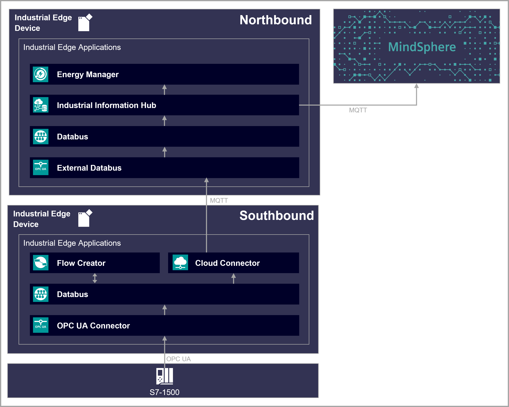

# Shopfloor to Cloud Connectivity - Integrate machine & production data securely into the company cloud

Use case for communication from Edge Device to Edge Device and company Cloud (e.g. MindSphere) via MQTT 

- [Shopfloor to Cloud Connectivity - Integrate machine & production data securely into the company cloud](#shopfloor-to-cloud-connectivity---integrate-machine--production-data-securely-into-the-company-cloud)
  - [Overview](#overview)
    - [Reference Architecture](#reference-architecture)
      - [Option 1: IE Cloud Connector - MindConnect IoT Extension](#option-1-ie-cloud-connector---mindconnect-iot-extension)
      - [Option 2: MindSphere Connector - MindSphere Native MQTT](#option-2-mindsphere-connector---mindsphere-native-mqtt)
    - [Network Architecture](#network-architecture)
  - [General task](#general-task)
  - [Requirements](#requirements)
    - [Prerequisites](#prerequisites)
    - [Used components](#used-components)
  - [Configuration Southbound Devices](#configuration-southbound-devices)
  - [Configuration Northbound Device](#configuration-northbound-device)
  - [Configuration MindSphere](#configuration-mindsphere)
  - [Documentation](#documentation)
  - [Contribution](#contribution)
  - [Licence and Legal Information](#licence-and-legal-information)

## Overview 

### Reference Architecture 

#### Option 1: IE Cloud Connector - MindConnect IoT Extension

#### Option 2: MindSphere Connector - MindSphere Native MQTT (coming soon)

### Network Architecture

## General task

Allows gathering energy data from various Devices and converting them to a standardized 
form in a southbound Edge Device with no internet access. 

Central monitoring energy data from multiple location in dashboards, with a strict separation between Automation Cell Network (Southbound) and Datacenter (Northbound). So there is no direct connection between Southbound and the connected PLCs with the Internet, this guideline minimize the security risk.

Sharing the standardized data with a northbound Edge Device, with internet connectivity, via MQTT.

Structuring the energy data in asset models according to the asset design in MindSphere in the northbound Edge Device
and forwarding them to MindSphere.

## Requirements

###  Prerequisites
- Industrial Edge Learning Path (Module 1-3)
- Established connection to 2 PLCs to acquire data with the Edge Device
- Access to an Industrial Edge Management System (IEM)
- Onboarded 3 Industrial Edge Devices (IEDs) on Industrial Edge Management
- Installed System App Configurators on IEM (S7 Connector Configurator, IE Databus Configurator, Cloud Connector Configurator) 
- Installed apps on Southbound-Devices (SIMATIC S7 Connector, IE Cloud Connector, IE Databus, IE Flow Creator)
- Installed apps on Northbound-Device (Data Service, IE Databus, IE Flow Creator, Energy Manager, IE MQTT Connector, IE Cloud Connector)
- Google Chrome (Version ≥ 72) or Firefox (Version ≥ 62)
- Access to MindSphere 
- MindConnect IoT Extension
- Energy Manager
  
### Used components

TIA & PLCs:
- TIA V16
- PLC 1512SP-1 PN FW V2.1

Industrial Edge:
- Industrial Edge Management V1.5.6
- Industrial Edge Device V1.5.0-21-amd64
- SIMATIC S7 Connector V1.6.0-8
- IE Databus V1.6.3
- IE MQTT Connector V1.5.1
- Data Service V1.3.3-13224869
- IE Flow Creator V1.3.3
- Energy Manager V1.2.0
- IE Cloud Connector V 1.6.2
- IE Mindsphere Connector
- Web browser (Mozilla or Chrome)

MindSphere:
- Asset Manager 
- MindConnect IoT Extension
- Energy Manager

## Configuration Southbound Devices

You can find the further information about the following steps in the [docs](docs/install_PLC_Devices_Southbound.md)

- Configure PLC project in TIA-Portal
- Configure PLC connections in Industrial Edge
  - SIMATIC S7 Connector
  - IE Databus 
- Configure Data preprocessing 
  - IE Flow Creator 
- Configure Connection to Northbound
  - IE Cloud Connector 

## Configuration Northbound Device

You can find the further information about the following steps in the [docs](docs/install_Device_Northbound.md)

- Configure Connection to Southbound
  - IE Databus 
  - IE MQTT Connector
  - Data Service
- **Option 1**: Configure Connection to MindSphere - MindConnect IoT Extension
  - IE Flow Creator
  - IE Cloud Connector
- **Option 2**: Configure Connection to MindSphere - MindSphere Native MQTT (coming soon)
  - IE Mindsphere Connector
- Configure visualization
  - Energy Manager

## Configuration MindSphere
You can find the further information about the following steps in the [docs](docs/install_MindSphere.md)

- Configure Connection to Northbound
  - Asset Manager
  - MindConnect IoT Extension
- Configure visualization
  - Energy Manager 

## Documentation

You can find further documentation and help in the following links
  - [Industrial Edge Hub](https://iehub.eu1.edge.siemens.cloud/#/documentation)
  - [Industrial Edge Forum](https://www.siemens.com/industrial-edge-forum)
  - [Industrial Edge landing page](https://new.siemens.com/global/en/products/automation/topic-areas/industrial-edge/simatic-edge.html)
  - [Industrial Edge Learning Path](https://siemens-learning-simaticedge.sabacloud.com/)
## Contribution

Thanks for your interest in contributing. Anybody is free to report bugs, unclear documentation, and other problems regarding this repository in the Issues section or, even better, is free to propose any changes to this repository using Merge Requests.

## Licence and Legal Information

Please read the [Legal information](LICENSE.md).

