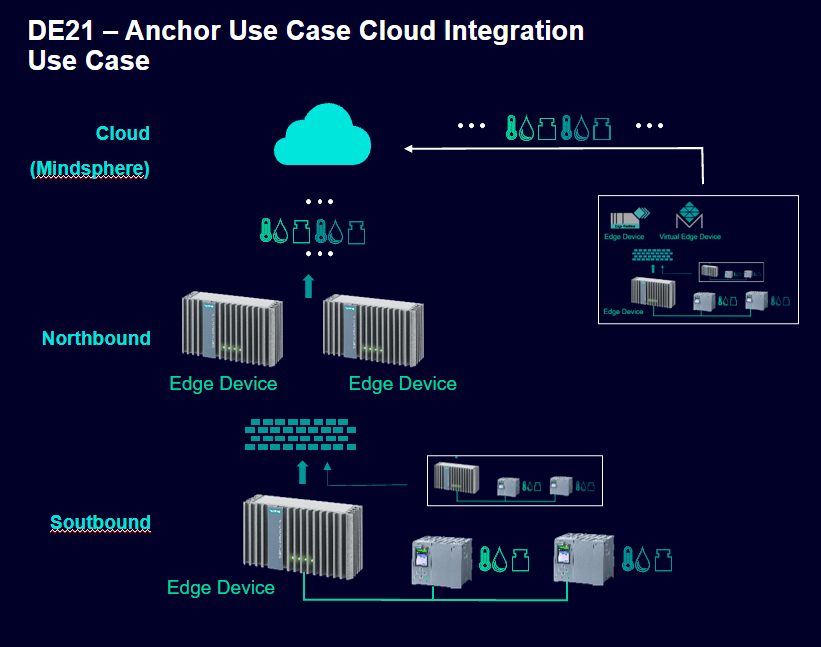
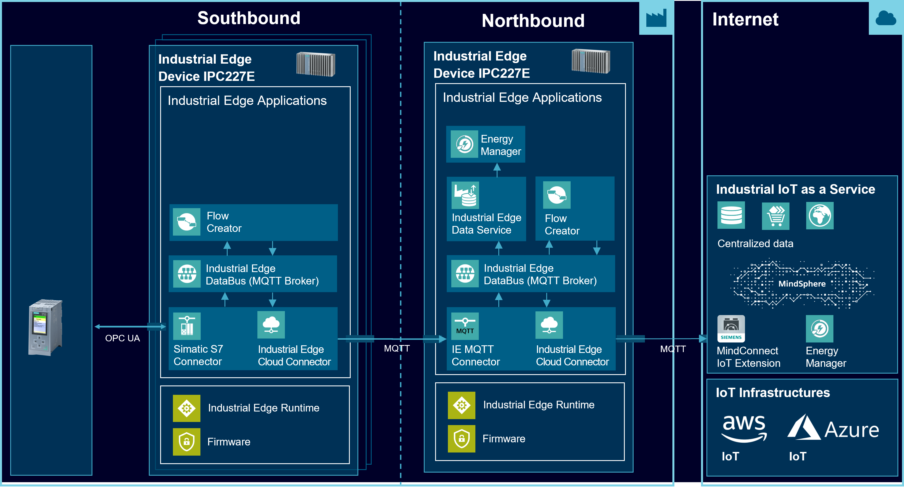
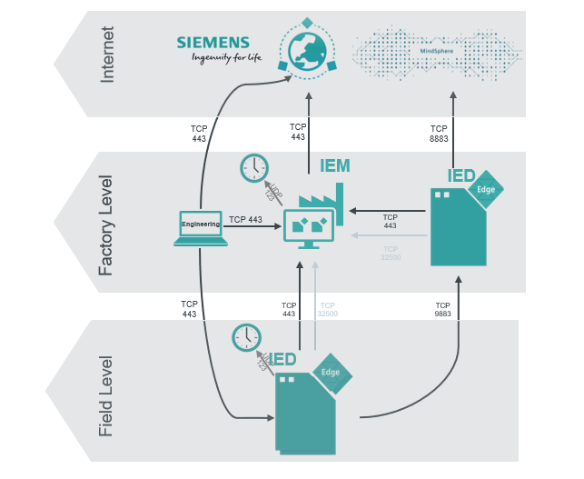

# Anchor-Use-Case-Cloud-Integration

Use case for communication from Edge Device to Edge Device and the Mindesphere via MQTT 

- [Anchor-Use-Case-Cloud-Integration](#anchor-use-case-cloud-integration)
    - [Overview](#overview)
      - [Reference Architecture](#reference-architecture)
      - [Network Architecture](#network-architecture)
    - [General task](#general-task)
    - [Prerequisites](#prerequisites)
    - [Used components](#used-components)
  - [Configuration Device Energy1 and Device Energy2](#configuration-device-energy1-and-device-energy2)
  - [Configuration Central Edge Device](#configuration-central-edge-device)
  - [Configuration MindSphere](#configuration-mindsphere)
  - [Documentation](#documentation)
  - [Contribution](#contribution)
  - [Licence and Legal Information](#licence-and-legal-information)

### Overview 

#### Reference Architecture

#### Network Architecture

### General task

Allows gathering energy data from various Devices and converting them to a standardized 
form in a southbound Edge Device with no Internet access. 

Sharing the standardized data with a northbound Edge Device, with internet connectivity, via MQTT.

Structuring the energy data in asset models according to the MindSphere design in the northbound Edge Device
and forwarding them to the MindSphere.

Allows centrally monitoring energy data from multiple location in dash boards.

###  Prerequisites

- 2 PLCs
- 2 Edge Devices
- 1 IEM
- List of required Apps:
  - Installed Apps Device Energy1 and Energy2: 
    - SIMATIC S7 Connector
    - IE Cloud Connector
    - IE Databus
    - IE Flow Creator
  - Installed Apps on Central Device:
    - Data Service
    - IE Databus
    - IE Flow Creator
    - Energy Manager
    - IE MQTT Connector
    -  IE Cloud Connector

- Google Chrome (Version ≥ 72) or Firefox (Version ≥ 62)
- Access to the MindSphere
  
### Used components
Industrial Edge:
- Industrial Edge Management V1.3.0
- IE Databus V1.3.5
- SIMATIC S7 Connector V 1.3.27
- MQTT Connector V1.2.9
- Cloud Connector V 1.3.1
- Data Service V1.3.0
- IE Flow Creator V1.1.10
- Energy Manager V1.2.0
- Industrial Edge Device V1.2.0-56
- Web browser (Mozilla or Chrome)

MindSphere:
- Asset Manager 
- MindConnect IoT Extension
- Energy Manager

## Configuration Device Energy1 and Device Energy2

You can find the further information about the following steps in the [docs](docs/install_PLC_Devices_Southbound.md)
- Configure S7 Connector, Cloud Connector, Databus, Flow Creator 

## Configuration Central Edge Device

You can find the further information about the following steps in the [docs](docs/install_Device_Northbound.md)
- Configure Databus, Flow Creator, Energy Manager, MQTT Connector, Cloud Connector

## Configuration MindSphere
You can find the further information about the following steps in the [docs](docs/install_MindSphere.md)
- Configure Asset Manager, MindConnect IoT Extension, Energy Manager 

## Documentation

You can find further documentation and help in the following links
  - [Industrial Edge Hub](https://iehub.eu1.edge.siemens.cloud/#/documentation)
  - [Industrial Edge Forum](https://www.siemens.com/industrial-edge-forum)
  - [Industrial Edge landing page](https://new.siemens.com/global/en/products/automation/topic-areas/industrial-edge/simatic-edge.html)
  
## Contribution

Thanks for your interest in contributing. Anybody is free to report bugs, unclear documentation, and other problems regarding this repository in the Issues section or, even better, is free to propose any changes to this repository using Merge Requests.

## Licence and Legal Information

Please read the [Legal information](LICENSE.md).

