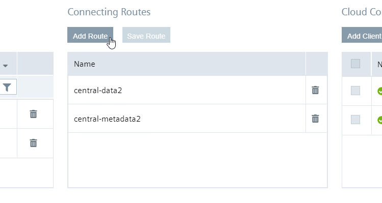
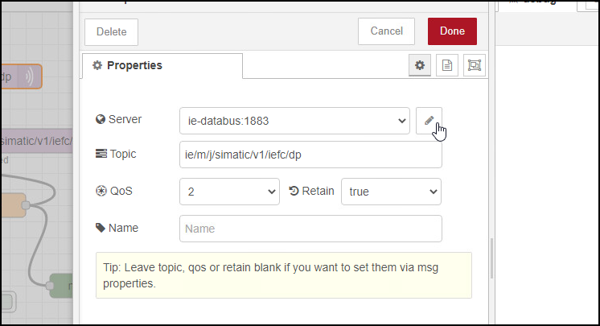

# Installation

- [Installation](#installation)
  - [Configure PLC project](#configure-plc-project)
  - [Configuration Device Energy1 and Energy2](#configuration-device-energy1-and-energy2)
  - [Configure Device Central](#configure-device-central)
  

## Configure PLC project

- Open TIA portal and open the project containing the EnergyManagement application (Adapt the IP addresses to your system)
- Download the PLC program to the PLC and set the PLC into RUN
   

## Configuration Device Energy1 and Energy2

**IE Databus**

Configure the user and topic in the Databus Configurator so the data can be found from the databus

- Launch the IE Databus Configurator and add your related credentials/topics:
`ie/#`

**S7 Connector**
  

To add the Data from the PLC to the databus you have to connect the PLC-variables with the S7-Connector

- Launch the S7 Connector and configure the PLC connection 
- Import the JSON file "ernergy1_S7_Connector" for Energy1 and "ernergy2_S7_Connector" for Energy2
- Deploy and start your S7 Connector configuration

**Cloud Connector** 

For the communication from Energy1 and Energy2 to the Central device the cloud connector must be configured. 
Configure starting from the left side "Bus Adaptor" to the right the "Cloud Connector Clients" Adapt the IP addresses to your system.
To deploy the configuration, initially click on your route and connect your topics from the bus adaptor with your cloud topics 
Then click on deploy. 
Note: You must create one topic for the data and one topic for the metadata. 

- Add the Topics in the Bus Adaptor Field
  One for the data and one for the metadata

  Energy1:
  `ie/m/j/simatic/v1/iefc/`
  `ie/d/j/simatic/v1/iefc/dp/r/Line1/default`
  
  Energy2:
  `ie/m/j/simatic/v1/iefc/dp` 
  `ie/d/j/simatic/v1/iefc/dp/r/line2/default`

  

- Add Connecting Routes
  
  Energy1:
  `central-data` 
  `central-metadata`
  
  Energy2:
  `central-data2`
  `central-metadata2`

- Add Cloud Connector Clients
  Type: `LOCAL_LAKE`
  
  Energy1:
  Data: `"ie/d/j/simatic/v1/iecc/dp/r/energy1line1/raw"`
  Metadata: `"ie/m/j/simatic/v1/iecc/dp/energy1line1"`
  
  Energy2:
  Data: `"ie/d/j/simatic/v1/iecc/dp/r/energy2line2/raw"`
  Metadata: `"ie/m/j/simatic/v1/iecc/dp/energy2line2"`

  
  
  

- Mark the data and metadata routs an click "Save Route" 
    
  
  
  

- Deploy your configuration

**Flow Creator**
The raw data from the PLC have to be aggregated to the four units: Energy, Water, Pressured Air and Produced Bottles. After aggregation the data are subscribed via MQTT to the Cloud Connector to send them to the Central Device. Additionally the topic from the metadata will be adjusted to prevent a collision with the data from S7-Connector

- Import the JSON-File
  
  Energy1:
  `FlowCreator_Energy1`
  Energy2:
  `FlowCreator_Energy2`

- Double click to a MQTT-Node  
- Login to the Databus
  

  

- Deploy the Flows

## Configure Device Central

**IE Databus**

Configure the user and topic in the Databus Configurator as already described above.  

- Launch the IE Databus Configurator and add your related credentials/topics:
`ie/#`

**Flow Creator**
The metadata from the data in the Cloud Connector have to be adjusted to prevent a collision with existing data. Also the data will be send back to the Cloud Connector to send them to the Mindsphere 

- Import the Flows from the JSON-File `FlowCreator_Central` as described above.

**Data Service**
To connect the Data Service with the data from the Cloud Connector you have to configure two adapters with the metadata-topic from the Cloud Connector in Energy1 and Energy2

- Got to the Data Service and 