# Installation

- [Installation](#installation)
  - [Configure PLC project](#configure-plc-project)
  - [Configuration Device Energy1 and Energy2](#configuration-device-energy1-and-energy2)
  - [Configure Device Central](#configure-device-central)
  - [Configure Mindsphere](#configure-mindsphere)
  

## Configure PLC project

- Open TIA portal and open the project containing the EnergyManagement application (Adapt the IP addresses to your system)
- Download the PLC program to the PLC and set the PLC into RUN
   

## Configuration Device Energy1 and Energy2

**IE Databus**

Configure the user and topic in the Databus Configurator so the data can be found from the Databus

- Launch the IE Databus Configurator and add your related credentials/topics:
`ie/#`

  

  

**IE S7 Connector**

To add the Data from the PLC to the Databus you have to connect the PLC-variables with the S7-Connector

- Launch the S7 Connector and configure the PLC connection 
- Import the JSON file ´energy1_S7_Connector´ for Energy1 and ´energy2_S7_Connector´ for Energy2
- Deploy and start your S7 Connector configuration

  

**IE Cloud Connector**

For the communication from Energy1 and Energy2 to the Central device the cloud connector must be configured. 
Configure starting from the left side "Bus Adaptor" to the right the "Cloud Connector Clients" Adapt the IP addresses to your system.
To deploy the configuration, initially click on your route and connect your topics from the bus adaptor with your cloud topics 
Then click on deploy. 
Note: You must create one topic for the data and one topic for the metadata. 

- Add the Metadata-topic in the Bus Adaptor Field

  Energy1:
  `ie/m/j/simatic/v1/iefc/`
  
  Energy2:
  `ie/m/j/simatic/v1/iefc/dp` 
  
      
    
  
- Add the Data-topic
-   Energy1:
  `ie/d/j/simatic/v1/iefc/dp/r/Line1/default`
  
  Energy2:
  `ie/d/j/simatic/v1/iefc/dp/r/line2/default`
    
    

- Add Connecting Routes
  
  Energy1:
  `central-data` 
  `central-metadata`
  
  Energy2:
  `central-data2`
  `central-metadata2`
  
    
  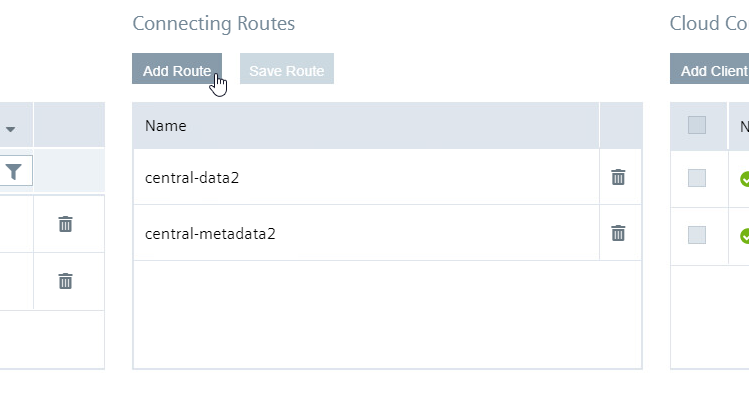

- Add Cloud Connector Clients
  Type: `LOCAL_LAKE`
  
  Energy1:
  Data: `"ie/d/j/simatic/v1/iecc/dp/r/energy1line1/raw"`
  Metadata: `"ie/m/j/simatic/v1/iecc/dp/energy1line1"`
  
  Energy2:
  Data: `"ie/d/j/simatic/v1/iecc/dp/r/energy2line2/raw"`
  Metadata: `"ie/m/j/simatic/v1/iecc/dp/energy2line2"`
  
    
  
    
      
  

- Mark the data and metadata routs an click "Save Route" 
      
        
  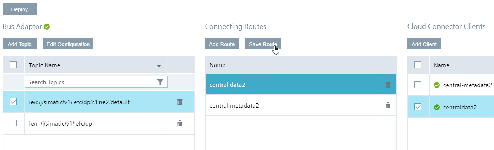
    
      
  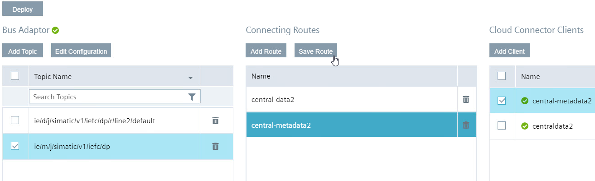

- Deploy your configuration

**IE Flow Creator**

The raw data from the PLC have to be aggregated to the four units: Energy, Water, Pressured Air and Produced Bottles. After aggregation the data are subscribed via MQTT to the Cloud Connector to send them to the Central Device. Additionally the topic from the metadata will be adjusted to prevent a collision with the data from S7-Connector

- Import the JSON-File
  
  Energy1:
  `FlowCreator_Energy1`
  Energy2:
  `FlowCreator_Energy2`
  
    
  

- Double click to a MQTT-Node  
- Login to the Databus
  
  
  
    
  

- Deploy the Flows

## Configure Device Central

**IE Databus**

Configure the User and Topic in the Databus Configurator as already described above.  

- Launch the IE Databus Configurator and add your related Credentials/Topics:
`ie/#`
  
    
  
  
    
  

**IE MQTT Connector**

To recieve the data from the Cloud Connector from Energy1 and Energy2 the MQTT Connector has to be configured
Configure the MQTT Connector similar to the Databus

- Launch the MQTT Connector and add your related credentials/topics:
`ie/#`
  
    
  

**IE Flow Creator**

The metadata from the data in the Cloud Connector have to be adjusted to prevent a collision with existing data. Also the data will be send back to the Cloud Connector to send them to the Mindsphere 

- Import the Flows from the JSON-File `FlowCreator_Central` as described above.

**IE Data Service**

To connect the Data Service with the data from the Cloud Connector you have to configure two adapters with the metadata-topic from the Cloud Connector in Energy1 and Energy2 

- Got to the Data Service and select "Adapters"
    
      
  

- click "+" to add a new adapter 
- Add one adapter for Energy1 and one adapter for Energy2
- Add the data as shown in the picture
  URL for Energy1 `ie/m/j/simatic/v1/iefc/dp/energy1line1`
  URL for Energy2 `ie/m/j/simatic/v1/iefc/dp/energy2line2`
  
    
  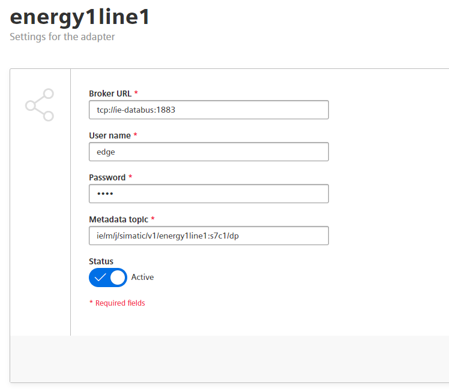
  
After the adapters are connected, you can find the data in the Dataservice.
- click on the first button on the left side
  
    
  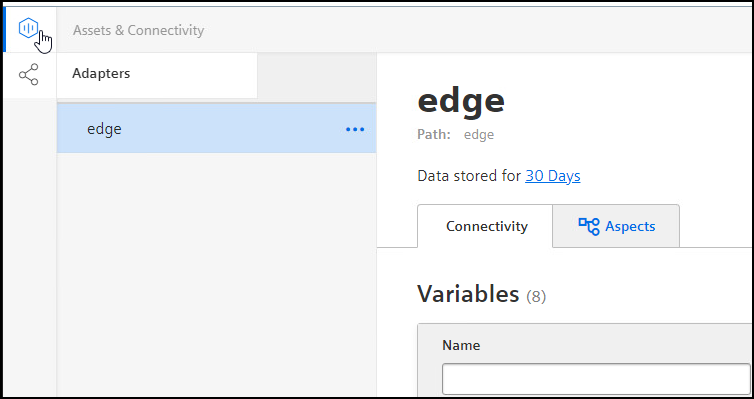

  With a click on the three points you can edit the asset.
  
    
  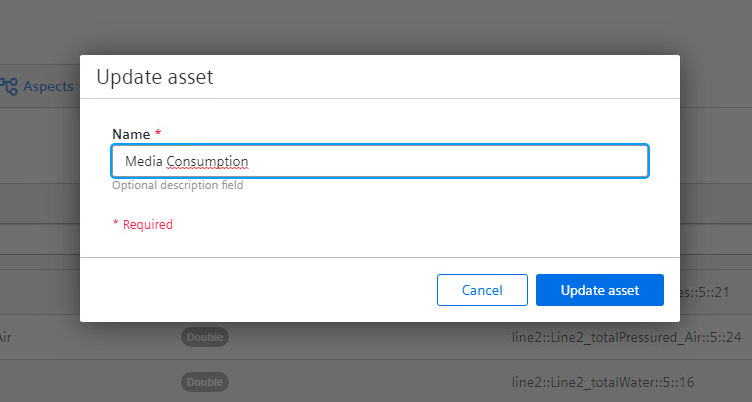

- to add the variables to the Data Service, click "Add multiple variables"
- select the adapter "energy1" mark all four variables and click "save"
- do the same for the adapter "energy2"
  
    
  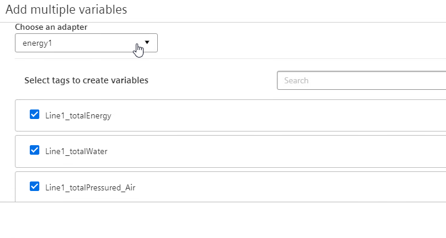

To sort the data and make it ready for the transfer to the Mindsphere it´s necessary to add aspects.
- click in the Data Service on the right side on the "Add aspect"
  

  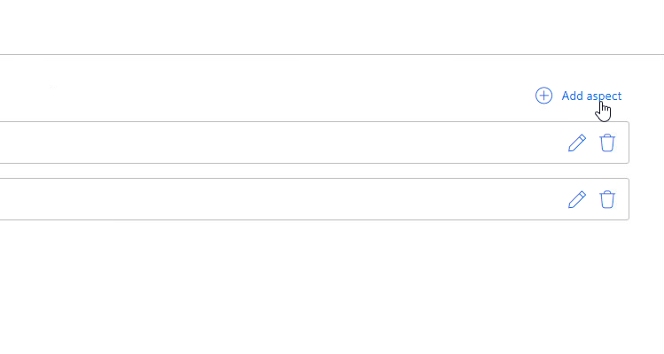

- choose the Data for Line1 and add them to the aspect. Do the same for Line2
  

  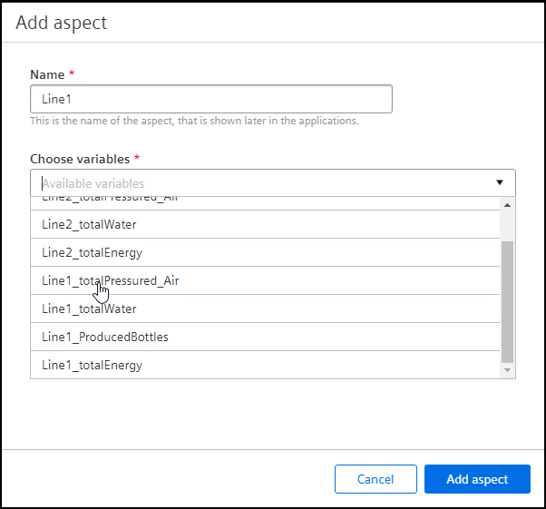

**IE Cloud Connector**

  For the communication with the Mindsphere the Cloud Connector must be configured.
  The steps are similar to description above
  
- Add the topics: 'ie/cloudconnector/energy1' and 'ie/cloudconnector/energy2' 
  
    
  

- Add Route
  
    
  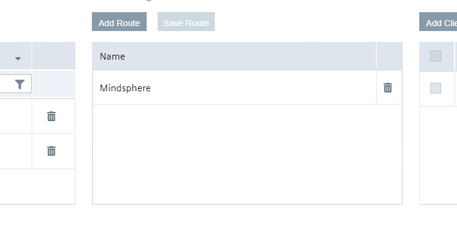
  
- Add Cloud Connector Clients
  
   
  

  
  
  
- Mark the Topics, Rout and Client and save the Rout
   
  
  
  
- Deploy the configuration

**IE Energy Manager**

The data will be committed to the Energy Manager to show them in a clear way
The total energy consumption, the energy consumption per bottle and the associated costs should be shown

- Add a new dashboard  "Overview Media Consumption"
  
  

- do the same for the dashboards "Media Consumption per Bottle Line1" and "Media Consumption per Bottle Line2"
  
Show the produced bottles from Line1 in a Value on Dahsboard "Overview Media Consumption"
- Click on "Create first widget"
- Select type "Value" and continue

  

- Name the widget "Produced Bottles Line1" and select the calculation period
  
  

- Select parameter
  
  

- Select "counter" for the aggregation

  

- Click "continue" twice and finish the configuration
- do the same for "Produced Bottles Line2"

Show the "Media Consumption Line1" as a line diagram
- Click "New widget"
- Select type "Diagram" and continue 
- Name the widget "Media Consumption Line1" and select the calculation 
  
  

Select parameter

  

- Select "counter" for the aggregation
- to change the colour of the lines click on the gear and 

  

Because of different units it´s necessary to adapt the "Y-axis"
- on rubric "5 Chart-Display options" click on the gear next to "Y-axis"
- assign the parameters as shown in the picture below

  

- do the same for the other line diagrams
  Note: for some diagrams KPIs are necessary, how to set them is explained in the next step

A gauge diagram is a way to give a quick overview about the momentary stand e.g. Energy per Bottle Line1
Here it´s necessary to generate a KPI that calculates the value

Add a new KPI
- click "Configuration" on the left side and select "KPI types"

  ![EnergyManager12] (graphics/EnergyManager12.png)

- Add "New KPI type"
- Edit Name and Unit
- Add the formula in case of this example ´totalEnergyLine1 / ProducedBottlesLine1´
  
  ![EnergyManager13] (graphics/EnergyManager13.png)

- After saving switch back to "My Plant" 
- Select the Dashboard "Media Consumption Bottle Line1"
- Add a new widget
- Select type "Gauge"
  
  

- Name the widget "Energy per Bottle Line1" and select the calculation period
  
  

- click "New KPI instance"
- mark "on basis of a KPI type" and select the KPI type
- add the associated variable to the operands

  

  

- add the limits of the gauge

  

  

Used KPI types:
  
- CostsPerBottle: `(Energy / 1000 * cost_kWh + PressuredAir * cost_Liter_Air + Water * cost_Liter_Water) / Bottles` Unit: €

- CostsPerLine: `(Energy / 1000 * cost_kWh + PressuredAir * cost_Liter_Air + Water * cost_Liter_Water)` Unit: €

- EnergyPerBottle: `Energy / Bottles` Unit: Wh

- PressuredAirPerBottle: `PressuredAir / Bottles` Unit: ml

- WaterPerBottle: `Water / Bottles` Unit: ml

## Configure Mindsphere

**Assett Manager**
In order to display the data of the lines in the Mindsphere, it is necessary to create the corresponding assets and aspects

- go to "library" and select "Aspect Types"
  
  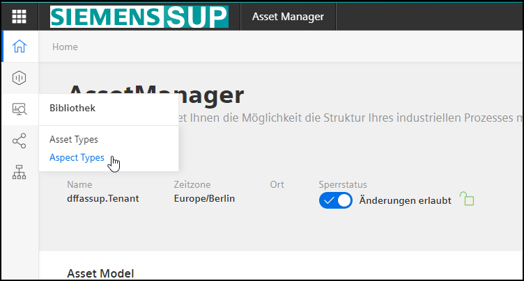

- ad a new Aspect "Media_Consumption_Line"
- fill in the Name and  "Dynamic"

  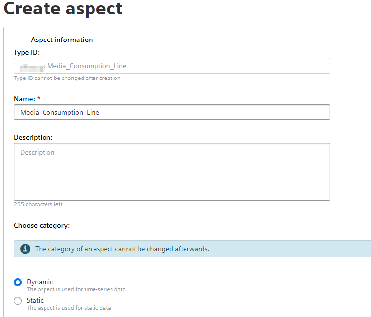

- Add the variables

   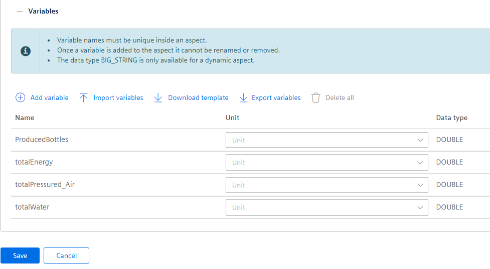

- go to "Asset Types"

  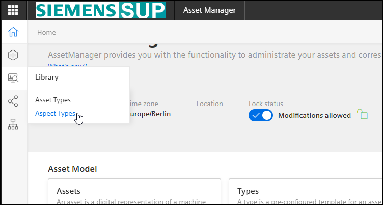

- create new type
  
  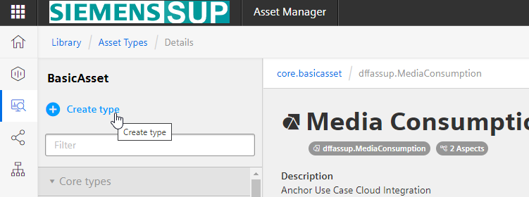

- Add name and aspects
  
  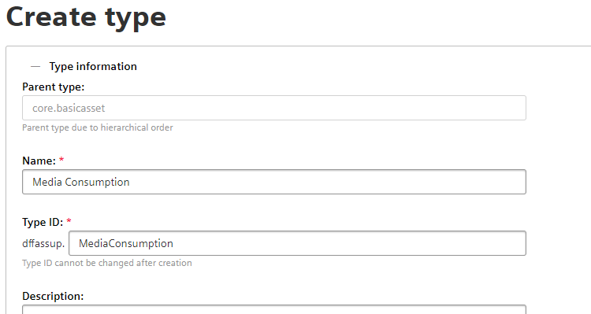

  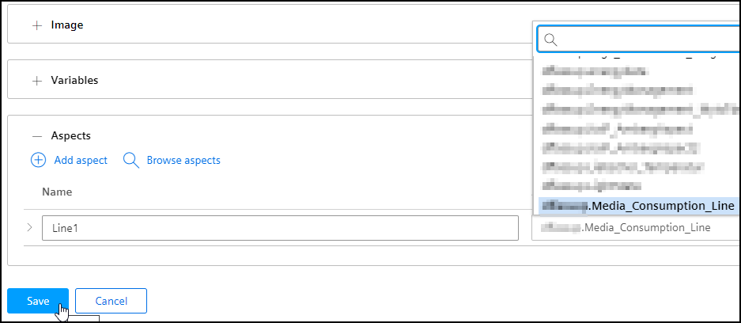

- finally the aspects "Line1" and "Line2" should be created

  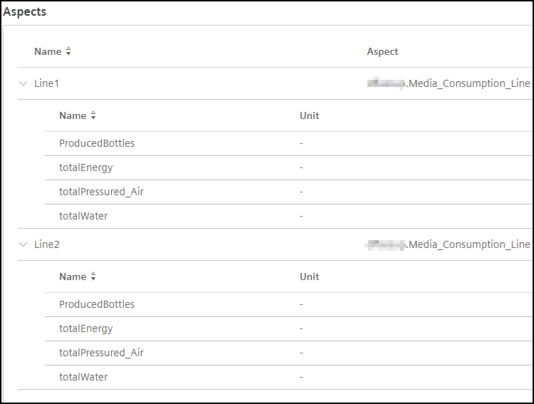

- go to "Assets"

  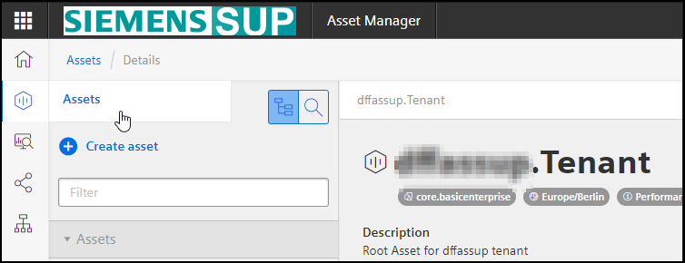

- create asset
- select type "Media Consumption"

  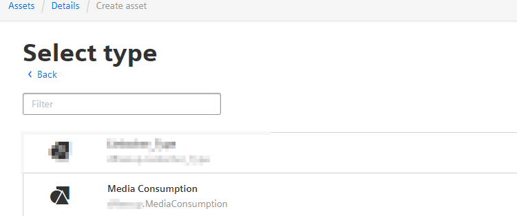

- name the Asset "Media Consumption Factory1" and safe your configuration

**MindConnect IoT Extension**
the MindConnect connects the data from the Central Edge Device with the assets 
- go to "Device mapping" -> "Device mapping"
  
  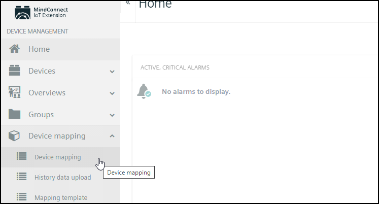

- select the asset "Media Consumption Factory1"
  
  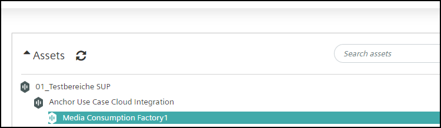

- click "Add mapping"
- map the Source to the created Target
  
  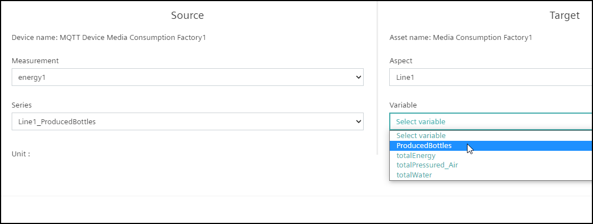

  

**Energy Manager**

The Energy Manager shows the data from the hole Factory1
  
  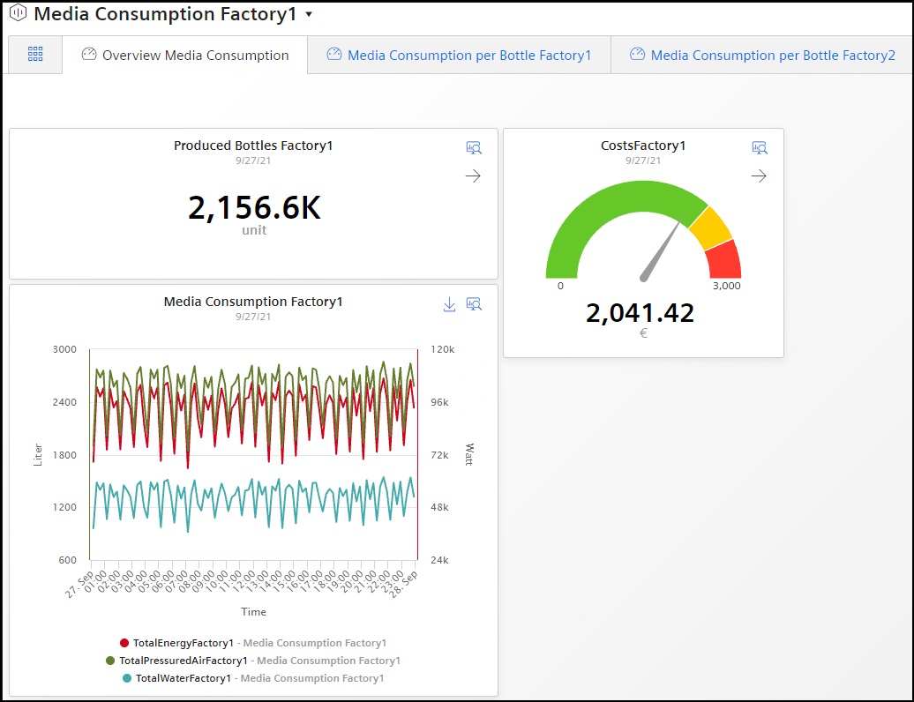
  
  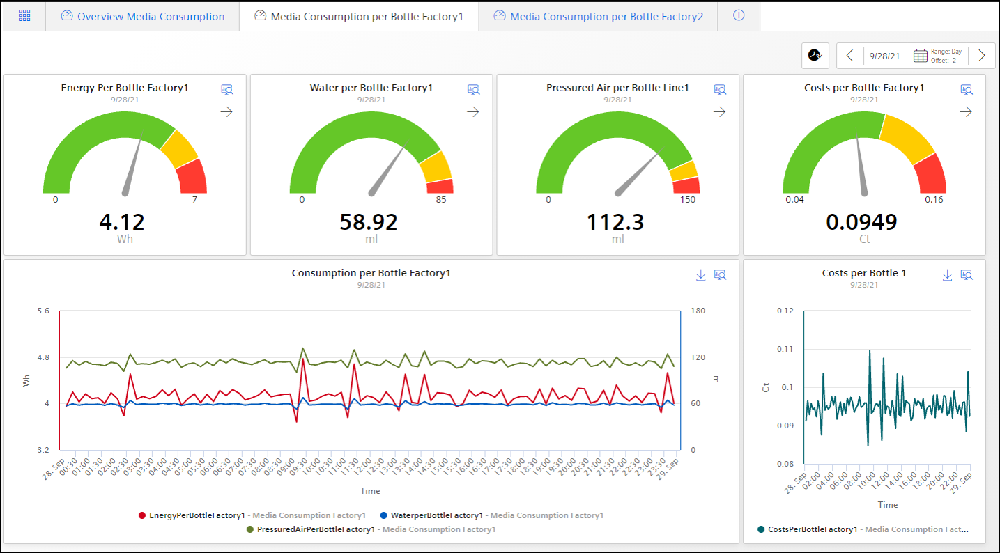

- the handling is the same as described under "Central Device Energy Manager"
  
- CostsPerBottle: `((EnergyLine1 + EnergyLine2) / 1000 * cost_kWh + (PressuredAirLine1 + PressuredAirLine2)`
                     `* cost_Liter_Air + (WaterLine1 + WaterLine2) * cost_Liter_Water) / Bottles` Unit: €

- CostsPerFactory: `((EnergyLine1 + EnergyLine2) / 1000 * cost_kWh + (PressuredAirLine1 + PressuredAirLine2)`
                     `* cost_Liter_Air + (WaterLine1 + WaterLine2) * cost_Liter_Water)/100` Unit: €

- EnergyPerBottle: `(EnergyLine1 + EnergyLine2) / (BottlesLine1 + BottlesLine2)` Unit: Wh

- PressuredAirPerBottle: `(PressuredAirLine1 + PressuredAirLine2) / (BottlesLine1 + BottlesLine2)` Unit: ml

- WaterPerBottle: `(WaterLine1 + WaterLine2) / (BottlesLine1 + BottlesLine2)` Unit: ml