# Configuration Steps

- [Configuration Steps](#configuration-steps)
- [Configure Northbound](#configure-northbound)
  - [IE Databus](#ie-databus)
  - [IE MQTT Connector](#ie-mqtt-connector)
  - [Option 1: IIH Mindsphere Sync](#option-1-iih-mindsphere-sync)
    - [Integrate Data Service](#integrate-data-service)
    - [Configure Connections](#configure-connections)
    - [Create the Asset Model](#create-the-asset-model)
  - [Option 2: MindConnect IoT Extension](#option-2-mindconnect-iot-extension)
    - [IE Flow Creator](#ie-flow-creator)
    - [IE Cloud Connector - MindConnect IoT Extension](#ie-cloud-connector---mindconnect-iot-extension)
  - [Northbound Device - Energy Manager](#northbound-device---energy-manager)
- [Navigation](#navigation)
  
# Configure Northbound

The Northbound consist of one device. In the following this is called "Central Device".
Installed Apps on Central Device:
  - Data Service
  - IE Databus
  - Energy Manager
  - IE MQTT Connector  
  - Option 1: IIH Mindsphere Sync
    - IIH Core
    - IIH Configurator
    - IIH Registry Service
    - IIH Databus Gateway
  - Option 2: MindConnect IoT Extension
    - IE Flow Creator
    - IE Cloud Connector

## IE Databus

Configure the User and Topic in the IE Databus Configurator as described [here](install_PLC_Devices_Southbound.md).  

Instead of manually configuring you can also import the configuration files:

[IE_Databus_Central](../src/CentralDevice/IE-Databus.json) (Password = Edge1234!)

1. Launch the IE Databus Configurator and add your related Credentials/Topics:

   - Username: `edge`
   - Password: `edge`
   - Topic: `ie/#`
   - Permission: `Publish and Subscribe`
  
    
  
  
 2. Deploy configuration to device

  

## IE MQTT Connector

To receive the data from the IE Cloud Connector from Energy1 and Energy2 the IE MQTT Connector has to be configured

Instead of manually configuring you can also import the configuration files:

[IE_MQTT_Connector_Central](../src/CentralDevice/IE_MQTT_Connctor_Central.json) (Password = Edge1234!)

1. Launch the IE MQTT Connector Configurator and add your related Credentials/Topics:

   - Username: `edge`
   - Password: `edge`

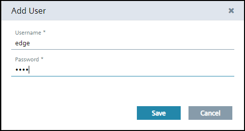

2. Add Topic and Permission

- Topic: `ie/#`
- Permission: `Publish and Subscribe`

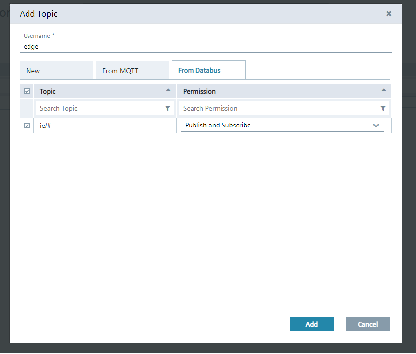
    

3. Set "Unsecure" in IE MQTT Connector

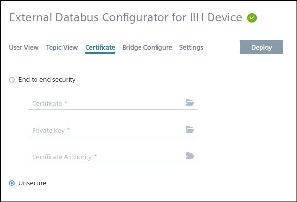

4. Bridge Configure

   - Insert User: `edge`
   - Insert password: `edge`
   - Select Topic:  `ie/#`
   - Direction: `IE MQTT Connector` :arrow_right: `IE Databus`

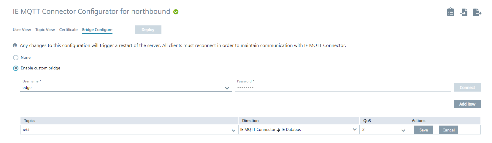

##  Option 1: IIH Mindsphere Sync

All the following steps for this option will be performed in the "IIH Configurator" app on the Central Device.

### Integrate Data Service

To store data in the Industrial Information Hub (IIH), it is required to integrate the Data Service Application. 
Be aware that all data that was previously stored will be lost.

1. Go to the "Store Data" tab

2. Click on "Integrate"
   
  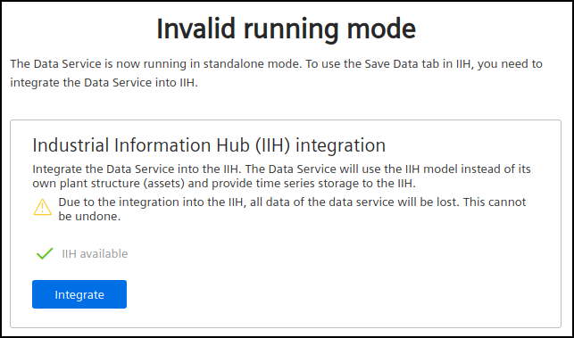

3. Confirm the integration in the popup window

  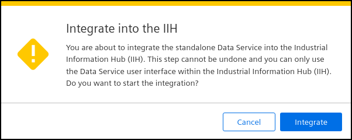

### Configure Connections

The IIH needs a connection to the IE Databus and to Mindsphere. You need to have a Mindsphere account and create
certificates to allow a connection from the IIH.

1. Configure the IE Databus credentials under "Settings > Databus credentials"

  

2. Save the configuration

3. Check if the device has a online connection in the "Home" tab. If the status is offline, please check your
   network settings and make sure that everything is configured correctly.

  

4. Click on "Add parent IED / Connect to Mindsphere"

  

5. Select the device type "Mindsphere Device"

6. Enter credentials for the application. Those are required, to allow the IIH to interact with Mindspheres REST-API.
   The Mindsphere Tenant Administrator has to create them and assign the role "mdsp:core:Admin3rdPartyTechUser", to
   allow the IIH to update the asset model in Mindsphere. More information can be found [here](https://documentation.mindsphere.io/MindSphere/apps/operator-cockpit/application-credentials-for-API-applications.html)

  

7. Enter the certificate details and upload the certificate and key. Information on how to create connector certificates
   can be found [here](https://documentation.mindsphere.io/MindSphere/howto/howto-managing-ca-certificates.html)

8. Select your region and save the configuration.

  

9. The connection will be established and you should see a green status in the IIH "Home" window

### Create the Asset Model

1. Go to "Define Data > Organize" to create a Asset Model and connect the variables

2. Add a Asset Model and name it by double clicking on it

3. Add two Aspects to structure the data according two our two machines

  

4. Now add 4 variables for each Aspect and give them names

5. On the left side below "Data Sources" you should see the two Databus topics with the variables from each machine

6. Assign those tags two the variables in your Asset model per drag & drop

  

7. Check the "Storage" and "Cloud Sync" checkbox for each variable

8. Deploy the configuration

The incoming data will now be stored in the integrated Data Service. Under "Store Data" you can see the created 
Asset model and the datapoints.

  

In MindSphere Energy Manager, you should now also see your data structure from the IIH.

  

## Option 2: MindConnect IoT Extension

### IE Flow Creator 

> **_NOTE:_** Only required when connecting to MindConnect IoT Extension. Otherwise you can skip to [Northbound Device - Energy Manager](#northbound-device---energy-manager)

The IE Flow Creator will extract the packaged data from IE Cloud Connector
and also converts the data to MindSphere IOT Extension data format

1. Import the Flows from the JSON-File [FlowCreator_Central](../src/CentralDevice/FlowCreator_Central.json) as described [here](install_PLC_Devices_Southbound.md)
   
2. Enter IE-Databus credentials

### IE Cloud Connector - MindConnect IoT Extension

Requirements:

- You must have a MindSphere account
- You must have the MindConnect IoT Extension Upgrade. This allows to use the MindConnect IoT Extension. To get the upgrade, your tenant admin needs to contact their assigned Account Executive or Customer Success Manager.
- For MindConnect IoT Extension user: [Managing Users Documentation](https://documentation.mindsphere.io/MindSphere/apps/mindconnect-IoT-extension/account-managing-users.html)
  - **Devicemanagement User**, assigned in MindConnect IoT Extension 

For the communication with MindSphere configure IE Cloud Connector accordingly.
The steps are similar to the description for Energy1 and Energy2. 
Instead of manually configuring you can also import the configuration files:

[CloudConnector_Central](../src/CentralDevice/CloudConnector_Central.json) (Password = Edge1234!)

1. Click "Edit Configuration" and login to the Databus.

  
  
2. Add the topics: `ie/cloudconnector/energy1` and `ie/cloudconnector/energy2` 
  
    
  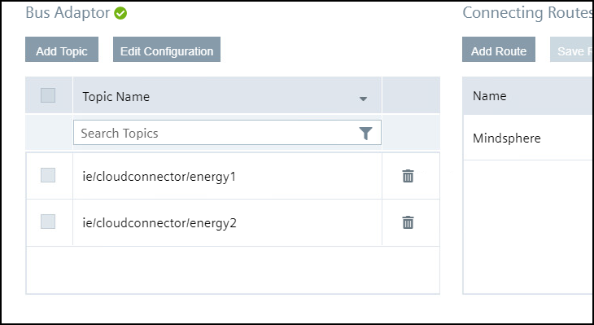

3. Add Route
  
    
  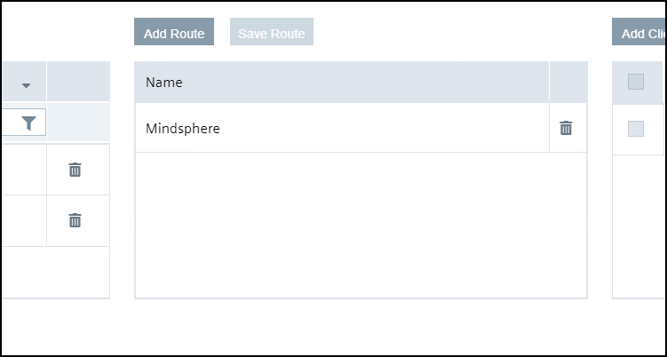
  
4. Add Cloud Connector Clients
  
   
  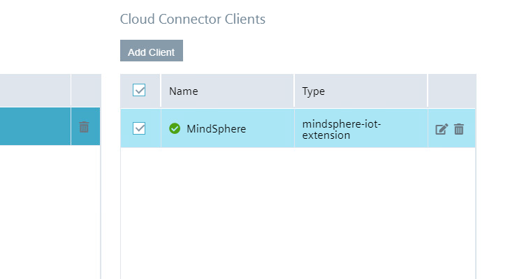

  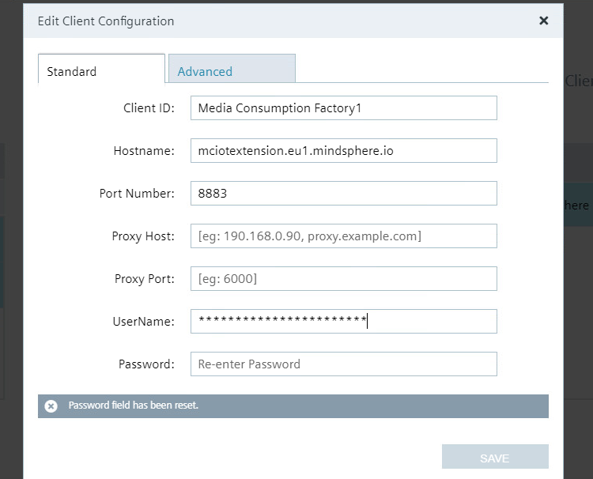

Example:  
- Hostname: mciotextension.eu1.mindsphere.io
- Tenant Name: demo
- Username: TenantName/username
  
1. Mark the Topics, Route and Client and save the Route
   
  
  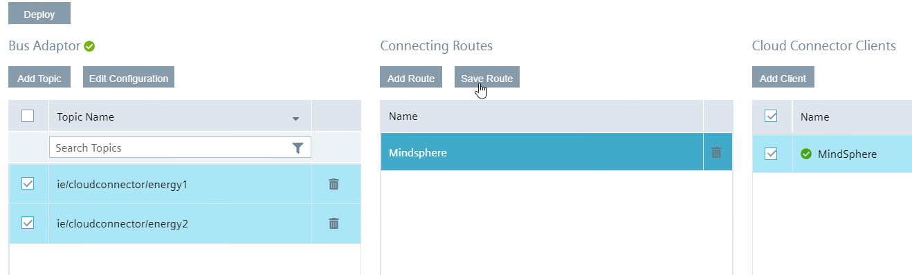
  
6. Deploy the configuration

## Northbound Device - Energy Manager

To analyze the data locally on the Edge Device, you can use Energy Manager App on the Northbound Device

Energy Manager displays the total energy consumption, the energy consumption per bottle and the associated costs for each line.

  

  

  

At first a ned dashboard, that contains the widgets will be created.

1. Add a new dashboard  "Overview Media Consumption"
  
  

2. Do the same for the dashboards "Media Consumption per Bottle Line1" and "Media Consumption per Bottle Line2"
  
Show the produced bottles from Line1 in a Value on Dashboard "Overview Media Consumption"

3. Click on "Create first widget"
   
4. Select type "Value" and continue

  

5. Name the widget "Produced Bottles Line1" and select the calculation period
  
  

6. Select parameter
  
  

7. Select "counter" for the aggregation

  

8. Click "continue" twice and finish the configuration
   
9.  Do the same for "Produced Bottles Line2"

Show the "Media Consumption Line1" as a line diagram

10. Click "New widget"
    
11. Select type "Diagram" and continue 
    
12. Name the widget "Media Consumption Line1" and select the calculation 
  
  

Select parameter

  

13. Select "counter" for the aggregation
    
14. To change the colour of the lines click on the gear and select the colour

  

Because of different units it´s necessary to adapt the "Y-axis"

15. On rubric 5 "Chart-Display options" click on the gear next to "Y-axis"
    
16. Assign the parameters as shown in the picture below

  

17. Do the same for the other line diagrams 
  
  Note: for some diagrams KPIs are necessary, how to set them is explained in the next step

A gauge diagram is a way to give a quick overview about the current values e.g. Energy per Bottle Line1  
Here it´s necessary to generate a KPI that calculates the value

In order not to configure all calculations individually, it´s helpful to create KPIs

18. Click "Configuration" on the left side and select "KPI types"

  

19. Add "New KPI type"
    
20. Edit Name and Unit
    
21. Add the formula in case of this example `totalEnergyLine1 / ProducedBottlesLine1`
  
  

22. After saving switch back to "My Plant" 
    
23. Select the Dashboard "Media Consumption Bottle Line1"
    
24. Add a new widget
    
25. Select type "Gauge"
  
  

26. Name the widget "Energy per Bottle Line1" and select the calculation period
  
  

27. Click "New KPI instance"
    
28. Mark "on basis of a KPI type" and select the KPI type
    
29. Add the associated variable to the operands

  

  

30. Add the limits of the gauge

  

  

Used KPI types:
  
- CostsPerBottle: `(Energy / 1000 * cost_kWh + PressuredAir * cost_Liter_Air + Water * cost_Liter_Water) / Bottles` Unit: €

- CostsPerLine: `(Energy / 1000 * cost_kWh + PressuredAir * cost_Liter_Air + Water * cost_Liter_Water)` Unit: €

- EnergyPerBottle: `Energy / Bottles` Unit: Wh

- PressuredAirPerBottle: `PressuredAir / Bottles` Unit: ml

- WaterPerBottle: `Water / Bottles` Unit: ml

# Navigation

[Overview](../README.md)

[Configuration Southbound Device](install_PLC_Devices_Southbound.md)

[Configuration MindSphere](install_MindSphere.md)
