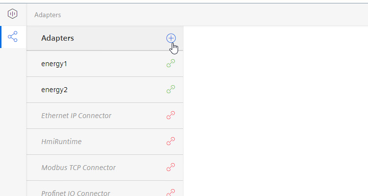
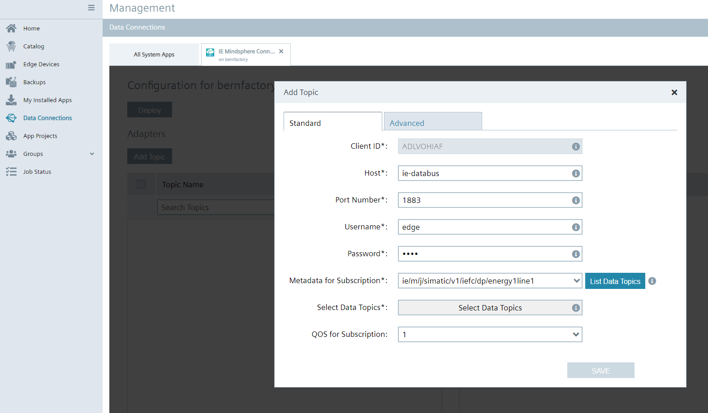
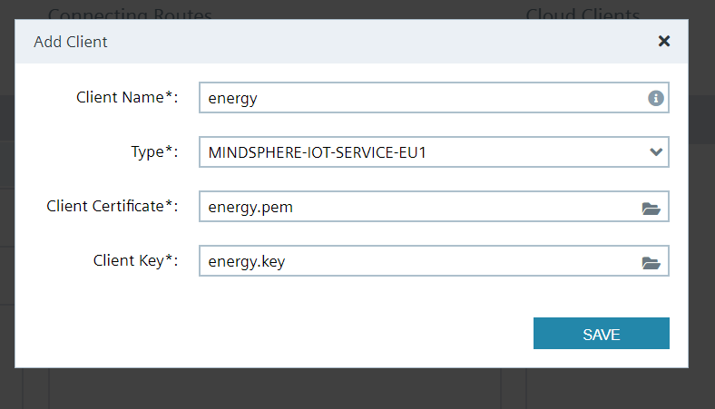
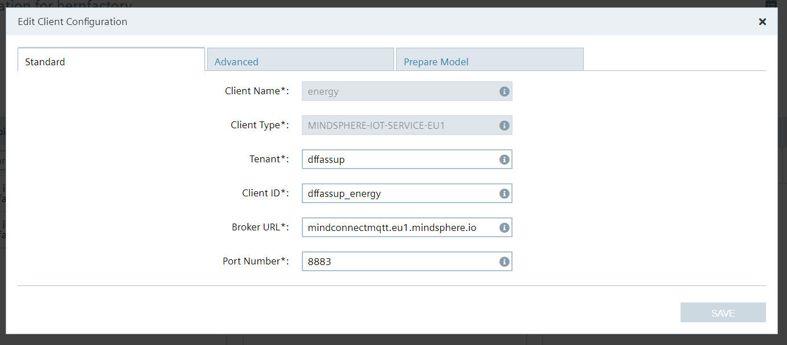
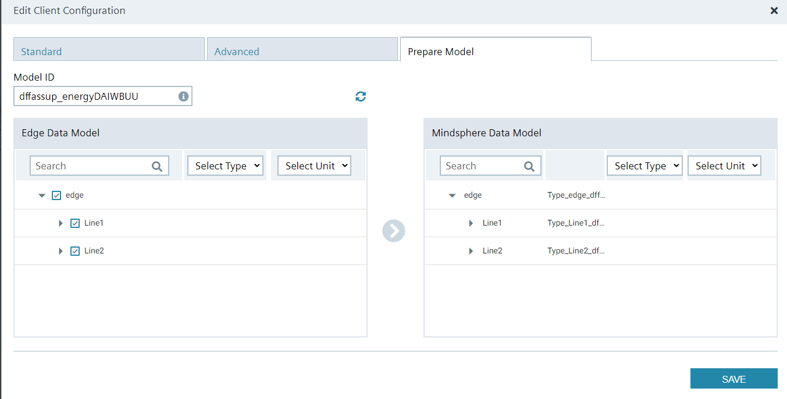
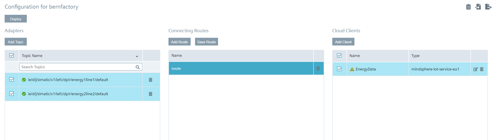
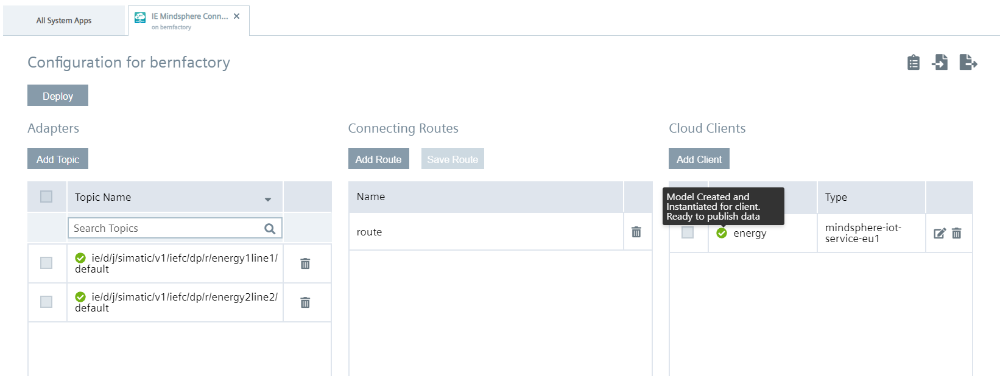

# Configuration Steps

- [Configuration Steps](#configuration-steps)
- [Configure Northbound](#configure-northbound)
  - [IE Databus](#ie-databus)
  - [IE MQTT Connector](#ie-mqtt-connector)
  - [Data Service](#data-service)
  - [Option 1: MindConnect MQTT](#option-1-mindconnect-mqtt)
    - [Create an agent private key](#create-an-agent-private-key)
    - [Configure IE MindSphere Connector](#configure-ie-mindsphere-connector)
  - [Option 2: MindConnect IoT Extension](#option-2-mindconnect-iot-extension)
    - [IE Flow Creator](#ie-flow-creator)
    - [IE Cloud Connector - MindConnect IoT Extension](#ie-cloud-connector---mindconnect-iot-extension)
  - [Northbound Device - Energy Manager](#northbound-device---energy-manager)
- [Navigation](#navigation)
  
# Configure Northbound

The Northbound consist of one device. In the following this is called "Central Device".
Installed Apps on Central Device:
  - Data Service
  - IE Databus
  - Energy Manager
  - IE MQTT Connector  
  - Option 1: MindConnect MQTT
    - IE Mindsphere Connector
  - Option 2: MindConnect IoT Extension
    - IE Flow Creator
    - IE Cloud Connector

## IE Databus

Configure the User and Topic in the IE Databus Configurator as described [here](install_PLC_Devices_Southbound.md).  

Instead of manually configuring you can also import the configuration files:

[IE_Databus_Central](../src/CentralDevice/IE-Databus.json) (Password = Edge1234!)

1. Launch the IE Databus Configurator and add your related Credentials/Topics:

   - Username: `edge`
   - Password: `edge`
   - Topic: `ie/#`
   - Permission: `Publish and Subscribe`
  
    
  
  
 2. Deploy configuration to device

  

## IE MQTT Connector

To receive the data from the IE Cloud Connector from Energy1 and Energy2 the IE MQTT Connector has to be configured

Instead of manually configuring you can also import the configuration files:

[IE_MQTT_Connector_Central](../src/CentralDevice/IE_MQTT_Connctor_Central.json) (Password = Edge1234!)

1. Launch the IE MQTT Connector Configurator and add your related Credentials/Topics:

   - Username: `edge`
   - Password: `edge`


2. Add Topic and Permission

- Topic: `ie/#`
- Permission: `Publish and Subscribe`


    


3. Set "Unsecure" in IE MQTT Connector


4. Bridge Configure

   - Insert User: `edge`
   - Insert password: `edge`
   - Select Topic:  `ie/#`
   - Direction: `IE MQTT Connector` :arrow_right: `IE Databus`


##  Data Service

In order to store the data send by the Cloud Connector of the Energy 1 and Energy 2 device, configure two adapters with the metadata topic from the Cloud Connector in Energy1 and Energy2.  

1. Go to the Data Service and select "Adapters"
     
  

2. Click "+" to add a new adapter 
   
3. Add one adapter for Energy1 and one adapter for Energy2
   
4. Add the data as shown in the picture
  
  URL for Energy1 `ie/m/j/simatic/v1/energy1line1:iefc/dp`

  URL for Energy2 `ie/m/j/simatic/v1/energy2line2:iefc/dp`

5. Save the configuration
   
6. Open the configuration again and set the status on "Active"
  
    
  
  
After the adapters are connected you can find the data in the Dataservice.

7. Click on the first button on the left side
  
    
  

8. With a click on the three points you can edit the asset.
  
    
  

9. To add the variables to the Data Service click "Add multiple variables"
    
10. Select the adapter "energy1" mark all four variables and click "save"
    
11. Do the same for the adapter "energy2"
  
    
  


To sort the data add aspects in the Data Service.

12. Click in the Data Service on the right side on the "Add aspect"
  

  

13. Choose the data for Line1 and add them to the aspect. Do the same for Line2
  

  
  

## Option 1: MindConnect MQTT

### Create an agent private key

On how to create the agent key, please refer to the [How To](https://documentation.mindsphere.io/MindSphere/howto/howto-onboard-mindconnect-mqtt.html) on https://mindsphere.io

```
set TENANT=<yourtenant>
set DEVICE_NAME=<yourdevicename>
set COUNTRY_CODE=<COUNTRY_CODE>
set CITY=<CITY>
set ORGANIZATION=<ORGANIZATION>
set CLIENT_ID="%TENANT%"_"%DEVICE_NAME%"
```

1. ```openssl genrsa -out %DEVICE_NAME%.key 2048```
2. ```openssl req -new -key %DEVICE_NAME%.key -out %DEVICE_NAME%.csr -subj "/C=%COUNTRY_CODE%/ST=%CITY%/O=%ORGANIZATION%/OU=IT/CN=%DEVICE_NAME%"```
3. ```openssl x509 -req -in %DEVICE_NAME%.csr -CA "%TENANT%.pem" -CAkey "%TENANT%.key" -CAcreateserial -out %DEVICE_NAME%.pem -days 365 -sha256```
4. ```type %DEVICE_NAME%.pem "%TENANT%.pem" > "%DEVICE_NAME%"_chain.pem```

You now have a private key for your agent: ```%DEVICE_NAME%".pem```

### Configure IE MindSphere Connector
In your management system, go to Data Connections -> IE MindSphere Connector -> Choose your device -> Launch.

1. Set up the Databus adapter for IE MindSphere Connector -> Click Add Topic, fill in the required info and select the correct topic.
   
  - Username: `edge`

  - Password: `edge`

  - Metadata for Subscription: `ie/m/j/simatic/v1/iefc/dp/energy1line1`

  Then select List Data Topics and choose `ie/d/j/simatic/v1/iefc/dp/r/energy1line1/default` from "Select Data Topics".
  Repeat these steps for `ie/m/j/simatic/v1/iefc/dp/energy2line2`

   

2. Create the MindSphere client by selecting "Add Client". 
   
  Choose a name and the type (Depending on your MindSphere tenant).
  Upload the previously created client certificate and key.

   

3. Edit your Cloud Client and select the Tenant & Client ID.
  > **_NOTE:_**  The Client ID must be in the format `tenant_yourClientName`.

   


5. Prepare the Model by selecting the data model on Edge which should be transferred to MindSphere.
   
   

6. Create a Route by clicking "Add Route", select a name, connect the topics and the client and click "Save Route".
  
    

6. Deploy the configuration.
 
   

In MindSphere Energy Manager, you should now see your data structure from Data Service.

  

## Option 2: MindConnect IoT Extension

### IE Flow Creator 

> **_NOTE:_** Only required when connecting to MindConnect IoT Extension. Otherwise you can skip to [Northbound Device - Energy Manager](#northbound-device---energy-manager)

The IE Flow Creator will extract the packaged data from IE Cloud Connector
and also converts the data to MindSphere IOT Extension data format

1. Import the Flows from the JSON-File [FlowCreator_Central](../src/CentralDevice/FlowCreator_Central.json) as described [here](install_PLC_Devices_Southbound.md)
   
2. Enter IE-Databus credentials

### IE Cloud Connector - MindConnect IoT Extension

For the communication with MindSphere configure IE Cloud Connector accordingly.
The steps are similar to the description for Energy1 and Energy2. 
Instead of manually configuring you can also import the configuration files:

[CloudConnector_Central](../src/CentralDevice/CloudConnector_Central.json) (Password = Edge1234!)

1. Click "Edit Configuration" and login to the Databus.

  
  
2. Add the topics: `ie/cloudconnector/energy1` and `ie/cloudconnector/energy2` 
  
    
  

3. Add Route
  
    
  
  
4. Add Cloud Connector Clients
  
   
  

  
  
  
5. Mark the Topics, Route and Client and save the Route
   
  
  
  
6. Deploy the configuration


## Northbound Device - Energy Manager

To analyze the data locally on the Edge Device, you can use Energy Manager App on the Northbound Device

Energy Manager displays the total energy consumption, the energy consumption per bottle and the associated costs for each line.

  

  

  

At first a ned dashboard, that contains the widgets will be created.


1. Add a new dashboard  "Overview Media Consumption"
  
  

2. Do the same for the dashboards "Media Consumption per Bottle Line1" and "Media Consumption per Bottle Line2"
  
Show the produced bottles from Line1 in a Value on Dashboard "Overview Media Consumption"

3. Click on "Create first widget"
   
4. Select type "Value" and continue

  

5. Name the widget "Produced Bottles Line1" and select the calculation period
  
  

6. Select parameter
  
  

7. Select "counter" for the aggregation

  

8. Click "continue" twice and finish the configuration
   
9.  Do the same for "Produced Bottles Line2"

Show the "Media Consumption Line1" as a line diagram

10. Click "New widget"
    
11. Select type "Diagram" and continue 
    
12. Name the widget "Media Consumption Line1" and select the calculation 
  
  

Select parameter

  

13. Select "counter" for the aggregation
    
14. To change the colour of the lines click on the gear and select the colour

  

Because of different units it´s necessary to adapt the "Y-axis"

15. On rubric 5 "Chart-Display options" click on the gear next to "Y-axis"
    
16. Assign the parameters as shown in the picture below

  

17. Do the same for the other line diagrams 
  
  Note: for some diagrams KPIs are necessary, how to set them is explained in the next step

A gauge diagram is a way to give a quick overview about the current values e.g. Energy per Bottle Line1  
Here it´s necessary to generate a KPI that calculates the value

In order not to configure all calculations individually, it´s helpful to create KPIs

18. Click "Configuration" on the left side and select "KPI types"

  

19. Add "New KPI type"
    
20. Edit Name and Unit
    
21. Add the formula in case of this example `totalEnergyLine1 / ProducedBottlesLine1`
  
  

22. After saving switch back to "My Plant" 
    
23. Select the Dashboard "Media Consumption Bottle Line1"
    
24. Add a new widget
    
25. Select type "Gauge"
  
  

26. Name the widget "Energy per Bottle Line1" and select the calculation period
  
  

27. Click "New KPI instance"
    
28. Mark "on basis of a KPI type" and select the KPI type
    
29. Add the associated variable to the operands

  

  

30. Add the limits of the gauge

  

  


Used KPI types:
  
- CostsPerBottle: `(Energy / 1000 * cost_kWh + PressuredAir * cost_Liter_Air + Water * cost_Liter_Water) / Bottles` Unit: €

- CostsPerLine: `(Energy / 1000 * cost_kWh + PressuredAir * cost_Liter_Air + Water * cost_Liter_Water)` Unit: €

- EnergyPerBottle: `Energy / Bottles` Unit: Wh

- PressuredAirPerBottle: `PressuredAir / Bottles` Unit: ml

- WaterPerBottle: `Water / Bottles` Unit: ml

# Navigation

[Overview](../README.md)

[Configuration Southbound Device](install_PLC_Devices_Southbound.md)

[Configuration MindSphere](install_MindSphere.md)
