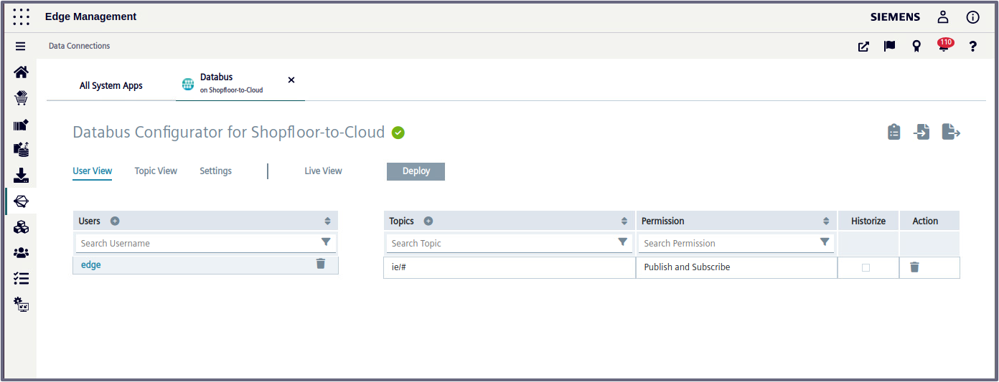
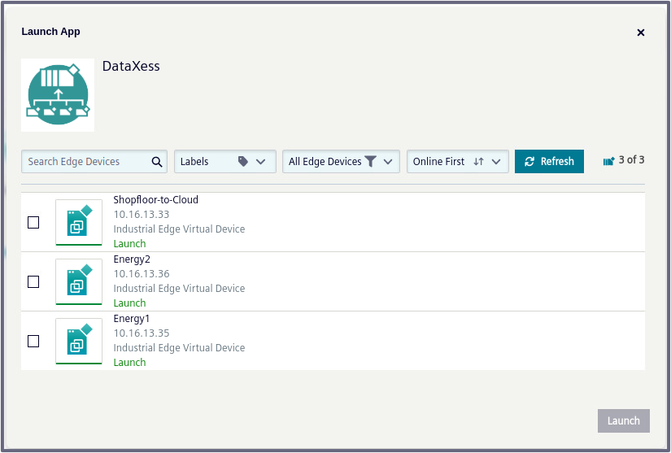
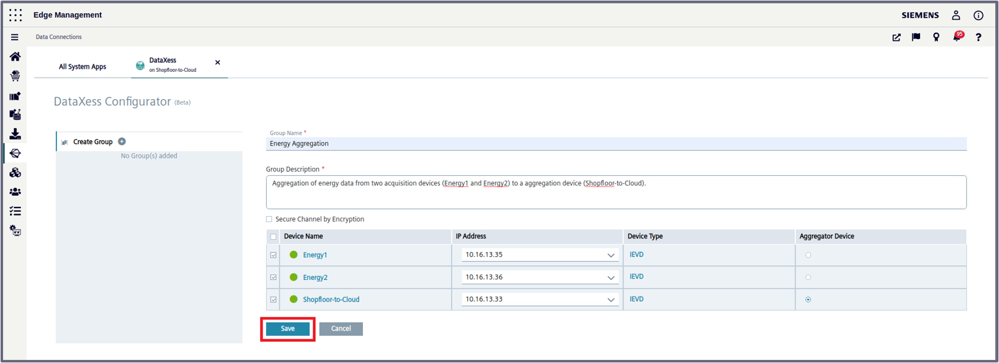

# Configuration Steps

- [Configuration Steps](#configuration-steps)
- [Configure Northbound](#configure-northbound)
  - [Create Databus Credentials and Topics](#create-databus-credentials-and-topics)
  - [Configure Communication with DataXess](#configure-communication-with-dataxess)
  - [Insights Hub Sync](#iih-insights-hub-sync)
    - [Integrate IIH Essentials](#integrate-iih-essentials)
    - [Configure Connections](#configure-connections)
    - [Create the Asset Model](#create-the-asset-model)
  - [Northbound Device - Energy Manager](#northbound-device---energy-manager)
- [Navigation](#navigation)
  
# Configure Northbound

The Northbound consist of one device. In the following this is called "Shopfloor-to-Cloud".
Installed Apps on Central Device:
  - IIH Essentials
  - Databus
  - Energy Manager
  - DataXess 
  - IIH Semmantics
  - Common Configurator
  - Registry Service

## Create Databus Credentials and Topics

Configure the User and Topic in the Databus Configurator as described [here](install_PLC_Devices_Southbound.md).  

Instead of manually configuring you can also import the configuration files:

[Databus_Central](../src/CentralDevice/IE-Databus.json) (Password = Edge1234!)

1. Launch the Databus Configurator and add your related Credentials/Topics:

   - Username: `edge`
   - Password: `edge`
   - Topic: `ie/#`
   - Permission: `Publish and Subscribe`
  
    
  
  
 2. Deploy configuration to device

  

## Configure Communication with DataXess

In this section, we will configure the communication between the two acquisition devices (Energy1 and Energy2) and the aggregation device (Shopfloor-to-Cloud).

To do this, follow these steps:

1. Go to *Industrial Edge Management UI > Data Connections* and open DataXess.
   
2. It doesn't matter which device you select to launch the app. The configuration will be done centrally for all devices at once.

 

3. Start the configuration by creating a new group
   
  

4. Add a group name and description and add all 3 devices to it. Make sure to select the central device as the "Aggregator Device" and click "Save".
   
  

5. Click on one of the setting symbols of your new created group to configure the data that get's exchanged. Select the topics `ie/d/j/simatic/v1/iefc/dp/r/#` and `ie/m/j/simatic/v1/iefc/dp` for both acquistion devices.
   
  
  

6. DataXess will automatically create new topics on the aggregator device were the data will be published.
   
  

7. Click "Deploy".
  
 
   
8. Configure a new user that will be used to subscribe and publish to the configured topics and click "Validate",
   
  

If everything was configured correctly, all devices should have a green status. Also, the general connection status msut be in green as well, as shown:

  

##  Insights Hub Sync

In this section, the necessary configurations will be made to establish communication with the cloud (Insights Hub).

All the following steps for this option will be performed in the "Common Configurator" app on the Aggregation Device (Shopfloor-to-cloud).

### Integrate IIH Essentials

To store data in the Industrial Information Hub (IIH), it is required to integrate the Data Service Application. 

1. Go to *Edge Device UI > Apps*, open *Common COnfigurator*. Then, go to *Store Data*.

2. Click on "Integrate"
   
  

3. Confirm the integration in the popup window

  

### Configure Connections

The IIH needs a connection to the Databus and to Insights Hub. You need to have a Insights Hub account and create
certificates to allow a connection from the IIH.

1. Configure the Databus credentials under "Settings > Databus credentials"

  

2. Save the configuration

3. Check if the device has an online connection in the "Home" tab, to proceed with configuring the Insights Hub connection.

  

4. Click on "Add parent IED / Connect to MindSphere"

  

5. Select the device type "MindSphere Device"

6. Enter credentials for the application. Those are required, to allow the IIH to interact with Insights Hubs REST-API.
   The Insights Hub Tenant Administrator has to create them and assign the role "mdsp:core:Admin3rdPartyTechUser", to
   allow the IIH to update the asset model in Insights Hub. More information can be found in the [IIH documentation](https://cache.industry.siemens.com/dl/dl-media/582/109803582/att_1087779/v6/EdgeApp_CommonConfigurator_en-US/en-US/index.html#treeId=487dc5ea471ae3fbdfb56d715301dad7) and [here](https://documentation.mindsphere.io/MindSphere/apps/operator-cockpit/application-credentials-for-API-applications.html) 

  

7. Enter the certificate details and upload the certificate and key. Information on how to create connector certificates
   can be found [here](https://documentation.mindsphere.io/MindSphere/howto/howto-onboard-mindconnect-mqtt.html) and [here](https://documentation.mindsphere.io/MindSphere/howto/howto-managing-ca-certificates.html)

8. Select your region and save the configuration.

  

9. The connection will be established and you should see a green status in the IIH "Home" window

### Create the Asset Model

1. Go to "Define Data > Organize" to create an Asset Model and connect the variables

2. Add an Asset and name it by double clicking on it

3. Add two Aspects to structure the data according two our two machines

  

4. Now add 4 variables for each Aspect and give them names

5. On the left side below "Data Sources" you should see the two Databus topics with the variables from each machine

6. Assign those tags two the variables in your Asset model per drag & drop

  

7. Check the "Storage" and "Cloud Sync" checkbox for each variable

8. Deploy the configuration

The incoming data will now be stored in the integrated Data Service. Under "Store Data" you can see the created 
Asset model and the datapoints.

  

In Insights Hub Energy Manager, you should now also see your data structure from the IIH.

  

## Northbound Device - Energy Manager

To analyze the data locally on the Edge Device, you can use Energy Manager App on the Northbound Device

Energy Manager displays the total energy consumption, the energy consumption per bottle and the associated costs for each line.

  

  

  

At first a ned dashboard, that contains the widgets will be created.

1. Add a new dashboard  "Overview Media Consumption"
  
  

2. Do the same for the dashboards "Media Consumption per Bottle Line1" and "Media Consumption per Bottle Line2"
  
Show the produced bottles from Line1 in a Value on Dashboard "Overview Media Consumption"

3. Click on "Create first widget"
   
4. Select type "Value" and continue

  

5. Name the widget "Produced Bottles Line1" and select the calculation period
  
  

6. Select parameter
  
  

7. Select "counter" for the aggregation

  

8. Click "continue" twice and finish the configuration
   
9.  Do the same for "Produced Bottles Line2"

Show the "Media Consumption Line1" as a line diagram

10. Click "New widget"
    
11. Select type "Diagram" and continue 
    
12. Name the widget "Media Consumption Line1" and select the calculation 
  
  

Select parameter

  

13. Select "counter" for the aggregation
    
14. To change the colour of the lines click on the gear and select the colour

  

Because of different units it´s necessary to adapt the "Y-axis"

15. On rubric 5 "Chart-Display options" click on the gear next to "Y-axis"
    
16. Assign the parameters as shown in the picture below

  

17. Do the same for the other line diagrams 
  
  Note: for some diagrams KPIs are necessary, how to set them is explained in the next step

A gauge diagram is a way to give a quick overview about the current values e.g. Energy per Bottle Line1  
Here it´s necessary to generate a KPI that calculates the value

In order not to configure all calculations individually, it´s helpful to create KPIs

18. Click "Configuration" on the left side and select "KPI types"

  

19. Add "New KPI type"
    
20. Edit Name and Unit
    
21. Add the formula in case of this example `totalEnergyLine1 / ProducedBottlesLine1`
  
  

22. After saving switch back to "My Plant" 
    
23. Select the Dashboard "Media Consumption Bottle Line1"
    
24. Add a new widget
    
25. Select type "Gauge"
  
  

26. Name the widget "Energy per Bottle Line1" and select the calculation period
  
  

27. Click "New KPI instance"
    
28. Mark "on basis of a KPI type" and select the KPI type
    
29. Add the associated variable to the operands

  

  

30. Add the limits of the gauge

  

  

Used KPI types:
  
- CostsPerBottle: `(Energy / 1000 * cost_kWh + PressuredAir * cost_Liter_Air + Water * cost_Liter_Water) / Bottles` Unit: €

- CostsPerLine: `(Energy / 1000 * cost_kWh + PressuredAir * cost_Liter_Air + Water * cost_Liter_Water)` Unit: €

- EnergyPerBottle: `Energy / Bottles` Unit: Wh

- PressuredAirPerBottle: `PressuredAir / Bottles` Unit: ml

- WaterPerBottle: `Water / Bottles` Unit: ml

# Navigation

[Overview](../README.md)

[Configuration Southbound Device](install_PLC_Devices_Southbound.md)

[Configuration Insights Hub](install_MindSphere.md)
