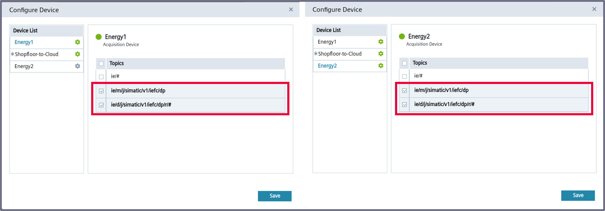
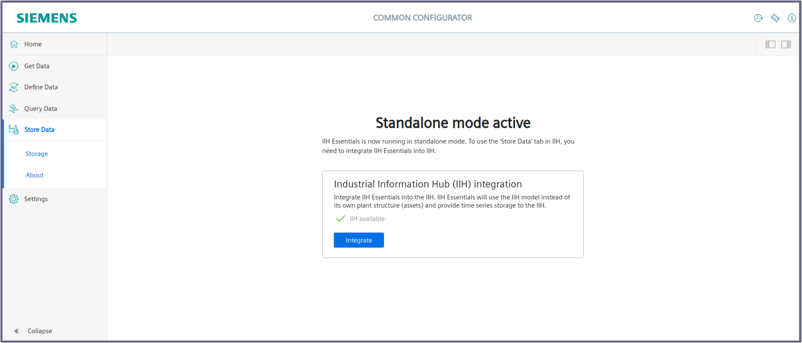
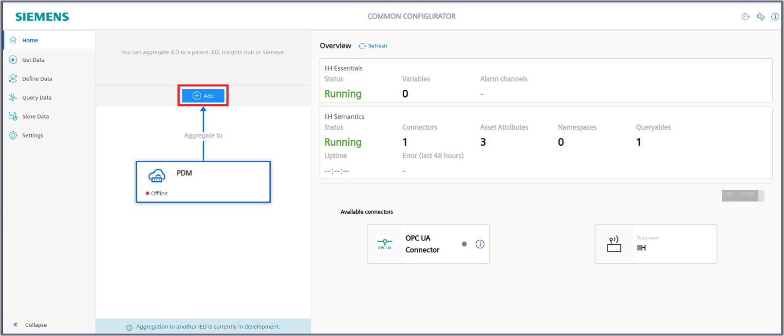
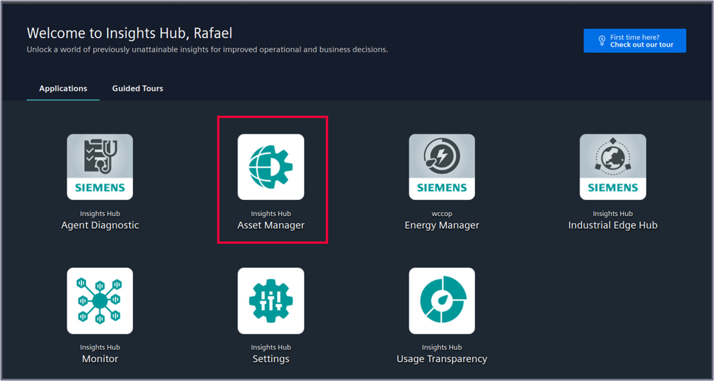
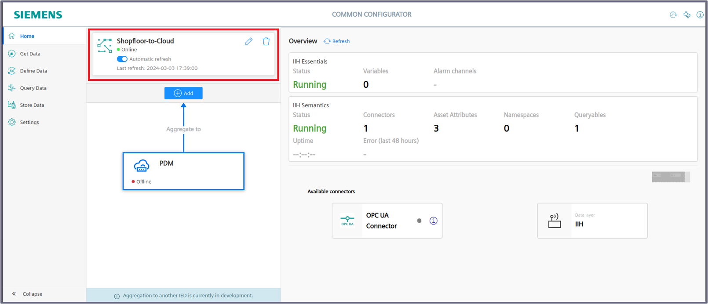
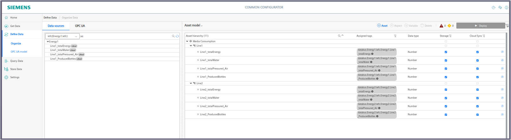
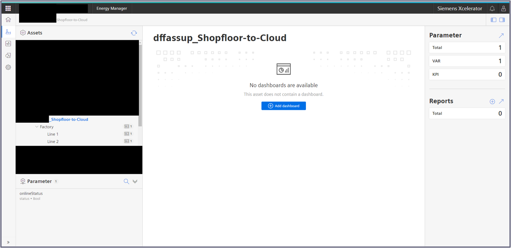

# Configuration Steps

- [Configuration Steps](#configuration-steps)
- [Configure Northbound](#configure-northbound)
  - [Create Databus Credentials and Topics](#create-databus-credentials-and-topics)
  - [Configure Communication with DataXess](#configure-communication-with-dataxess)
  - [Insights Hub Sync](#insights-hub-sync)
    - [Integrate IIH Essentials into Common Configurator](#integrate-iih-essentials-into-common-configurator)
    - [Configure Connection to Insights Hub](#configure-connection-to-insights-hub)
    - [Create the Asset Model](#create-the-asset-model)
- [Navigation](#navigation)
  
# Configure Northbound

The Northbound consist of one device. In the following this is called "Shopfloor-to-Cloud".
Installed Apps:
  - IIH Essentials
  - Databus
  - DataXess 
  - IIH Semantics
  - Common Configurator
  - Registry Service

## Create Databus Credentials and Topics

Configure the User and Topic in the Databus Configurator as described [here](install_PLC_Devices_Southbound.md).  

Instead of manually configuring you can also import the configuration files:

[Databus_Central](../src/CentralDevice/IE-Databus.json) (Password = Edge1234!)

1. Launch the Databus Configurator and add your related Credentials/Topics:

   - Username: `edge`
   - Password: `edge`
   - Topic: `ie/#`
   - Permission: `Publish and Subscribe`
  
    
  
  
 2. Deploy configuration to device

  

## Configure Communication with DataXess

In this section, we will configure the communication between the two acquisition devices (Energy1 and Energy2) and the aggregation device (Shopfloor-to-Cloud).

To do this, follow these steps:

1. Go to *Industrial Edge Management UI > Data Connections* and open DataXess.
   
2. It doesn't matter which device you select to launch the app. The configuration will be done centrally for all devices at once.

 

3. Start the configuration by creating a new group
   
  

4. Add a group name and description and add all 3 devices to it. Make sure to select the central device as the "Aggregator Device" and click "Save".
   
  

5. Click on one of the setting symbols of your new created group to configure the data that get's exchanged. Select the topics `ie/d/j/simatic/v1/iefc/dp/r/#` and `ie/m/j/simatic/v1/iefc/dp` for both acquistion devices.
   
  
  

6. DataXess will automatically create new topics on the aggregator device were the data will be published.
   
  

7. Click "Deploy".
  
 
   
8. Configure a new user that will be used to subscribe and publish to the configured topics and click "Validate",
   
  

If everything was configured correctly, all devices should have a green status. Also, the general connection status msut be in green as well, as shown:

  

##  Insights Hub Sync

In this section, the necessary configurations will be made to establish communication with the cloud (Insights Hub).

All the following steps for this option will be performed in the "Common Configurator" app on the Aggregation Device (Shopfloor-to-cloud).

### Integrate IIH Essentials into Common Configurator

1. Go to *Edge Device UI > Apps*, open *Common Configurator*. Then, go to *Store Data*.

2. Click on "Integrate"
   
  

3. Confirm the integration in the popup window

  

### Configure Connection to Insights Hub

Common Configurator needs a connection to the Databus and to Insights Hub. 

You need to have a Insights Hub account and create certificates to allow a connection from the Common Configurator.

1. Configure the Databus credentials under "Settings > Databus credentials"

   

2. Save the configuration

3. Proceed with configuring the Insights Hub connection by clicking "Add" button.

    

4. Select the Target type. Those are required to allow the Common Configurator to interact with Insights Hubs REST-API.

    

    You need to fill those 3 sections in order to get a proper interaction with Insights Hub:

    - Credentials for the application.
    - Certificate Credentials.
    - Advanced Configuration.

    **Credentials for the application**

    In this section, how to fill this information will be explained:

    

    To allow Common Configurator to update the asset model in Insights Hub, The IH Tenant Administrator has to create a **Technical User** and add the following roles:

    - mdsp:core:assetmanagement.admin
    - mdsp:core:assetmodeler.fullaccess
    - mdsp:core:mindconnect.fullaccess
    
    To do this, go to *Insights Hub UI > Settings*:

    

    Go to *User Management > Technical Users*:

    

    Select *Create technical user*:

    

    Assign a name and click on "Create technical user":

    

    The following tab will appear. Make sure to save the generated password and assign the previously described roles:

    

    And that's it. Now assign the required information as follows:

    - Name: Shopfloor-to-Cloud
    - App Id: *enter the technical user you created*
    - Password: *enter the technical user generated password*

    > [!IMPORTANT]  
    > More information can be found in the [IIH documentation](https://cache.industry.siemens.com/dl/dl-media/582/109803582/att_1087779/v6/EdgeApp_CommonConfigurator_en-US/en-US/index.html#treeId=487dc5ea471ae3fbdfb56d715301dad7) and [here](https://documentation.mindsphere.io/MindSphere/apps/operator-cockpit/application-credentials-for-API-applications.html)
      

    **Certificate Credentials.**

    In this section, how to fill this information will be explained:

    

    To do this, go to *Insights Hub UI > Asset Manager*:

    

    Then, go to *Asset Manager > Connectivity > MQTT Certificates*:

    

    Click on "Create a new certificate":

    

    Now, select the type of authentication:

    

    Create the certificate name and enter the author email:

    

    As soon as you click on the "Create & Download" button, the following files will be automatically downloaded:

    - Certificate file (.pem)
    - Certificate key file (.key)

    And that's it. Now assign the required information as follows:

    - Tenant: *enter your Insights Hub Tenant* you can find this in your Insights Hub URL "https://[tenant].[region].mindsphere.io/home" 
    - Device name: *enter your device name, for this case, it was named "Shopfloor-to-Cloud"*
    - Certificate: *upload the .pem file*
    - Key: *upload the .key file*
    - Region *enter your region* you can find this in your Insights Hub URL "https://[tenant].[region].mindsphere.io/home" 
    - Broker URL: mindconnectmqtt.eu1.mindsphere.io
    - Broker Port: 8883

    > [!IMPORTANT]  
    > Information on how to create connector certificates can be found [here](https://documentation.mindsphere.io/MindSphere/howto/howto-onboard-mindconnect-mqtt.html), [here](https://documentation.mindsphere.io/MindSphere/howto/howto-managing-ca-certificates.html) and [here](https://documentation.mindsphere.io/MindSphere/howto/howto-obtaining-auto-generated-agent-certificate.html)
      
    **Advanced Configuration**

    In this section, how to fill this information will be explained:

    

    Assign the required information as follows:

    - Insights Hub Broker Root CA: *upload the .pem file, for this case, you can leave in blank*
    - Publishing interval in seconds: *enter the period of time between each publication of data collected by the connected device*
    - MQTT QoS: *enter the message delivery guarantee level to the MQTT protocol*

5. Click "Save". The connection will be established and you should see a green status in the Insights Hub connection on the Common Configurator "Home" window:

   

### Create the Asset Model

1. Go to "Define Data > Organize" to create an Asset Model and connect the variables

2. Add an Asset and name it by double clicking on it

3. Add the following structure:

  

4. On the left side below "Data Sources" you should see the two Databus topics with the variables from each machine

5. Drag and Drop those variables to their corresponding aspect, like so:

  

  > [!IMPORTANT]  
  > Check the "Storage" and "Cloud Sync" checkbox for each variable

8. Deploy the configuration

The incoming data from Energy1 and Energy2 will now be stored in the integrated IIH Essentials. Under "Store Data" you can see the created Asset model and the datapoints.

  
  

In Insights Hub Energy Manager, you should now also see your data structure from Common Configurator.

  

Up to this point, the following steps have been completed:

- Communication has been established between the Southbound devices (Energy1 and Energy2) and the Northbound device (Shopfloor-to-Cloud).

- Communication has been established between the Northbound device (Shopfloor-to-Cloud) and the cloud (Insights Hub).

From here onwards, the Energy Manager application hosted in the cloud will be used to create a dashboard with the preprocessed data sourced from the Northbound device.

This Energy Manager will be setup in [here](install_MindSphere.md)

# Navigation

[Overview](../README.md)

[Configuration Southbound Device](install_PLC_Devices_Southbound.md)

[Configuration Insights Hub](install_MindSphere.md)
