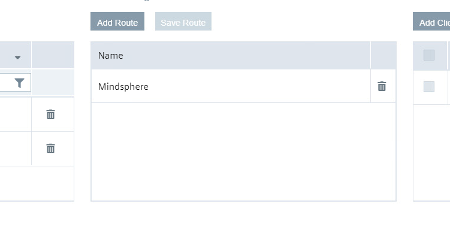

# Installation

- [Installation](#installation)
  - [Configure Device Central](#configure-device-central)
    - [IE Databus](#ie-databus)
    - [IE MQTT Connector](#ie-mqtt-connector)
    - [IE Flow Creator](#ie-flow-creator)
    - [IE Data Service](#ie-data-service)
    - [IE Cloud Connector](#ie-cloud-connector)
    - [ Energy Manager](#-energy-manager)
  

## Configure Device Central

### IE Databus

Configure the User and Topic in the IE Databus Configurator as already described.  

- Launch the IE Databus Configurator and add your related Credentials/Topics:
`ie/#`
  
    
  
  
    
  

### IE MQTT Connector

To recieve the data from the IE Cloud Connector from Energy1 and Energy2 the IE MQTT Connector has to be configured

This is the same configuration as IE Databus.
    
  

Only thing thats necessary to configure is to use unsecure (unencrypted)

  

### IE Flow Creator

The IE Flow Creator will extract the packaged data from IE Cloud Connector
Also converting the data to MindSphere IOT Extension data format

- Import the Flows from the JSON-File [FlowCreator_Central](FlowCreator_Central.json) as described above.

### IE Data Service

In order to connect the IE Data Service with the data from the Cloud Connector, configure two adapters with the metadata topic from the Cloud Connector in Energy1 and Energy2.  

- Go to the Data Service and select "Adapters"
    
      
  

- click "+" to add a new adapter 
- Add one adapter for Energy1 and one adapter for Energy2
- Add the data as shown in the picture
  URL for Energy1 `ie/m/j/simatic/v1/iefc/dp/energy1line1`
  URL for Energy2 `ie/m/j/simatic/v1/iefc/dp/energy2line2`
  
    
  
  
After the adapters are connected you can find the data in the Dataservice.
- click on the first button on the left side
  
    
  

- With a click on the three points you can edit the asset.
  
    
  

- to add the variables to the Data Service click "Add multiple variables"
- select the adapter "energy1" mark all four variables and click "save"
- do the same for the adapter "energy2"
  
    
  

To sort the data and make it ready for the transfer to the MindSphere it´s necessary to add aspects.
- click in the Data Service on the right side on the "Add aspect"
  

  

- choose the data for Line1 and add them to the aspect. Do the same for Line2
  

  

### IE Cloud Connector

For the communication with the MindSphere configure the IE Cloud Connector.
The steps are similar to the description for Energy1 and Energy2 above. 
Instead of configure the IE Cloud Connector, you can also import the configuration files:

[CloudConnector_Central](CloudConnector_Central.json)

- Click "Edit Configuration" and login to the Databus.

  
  
- Add the topics: `ie/cloudconnector/energy1` and `ie/cloudconnector/energy2` 
  
    
  

- Add Route
  
    
  
  
- Add Cloud Connector Clients
  
   
  

  
  
  
- Mark the Topics, Rout and Client and save the Rout
   
  
  
  
- Deploy the configuration

###  Energy Manager

The data will be committed to the Energy Manager to show them in a clear way.
The total energy consumption, the energy consumption per bottle and the associated costs for each line are displayed.

  

  

  

- Add a new dashboard  "Overview Media Consumption"
  
  

- do the same for the dashboards "Media Consumption per Bottle Line1" and "Media Consumption per Bottle Line2"
  
Show the produced bottles from Line1 in a Value on Dashboard "Overview Media Consumption"
- Click on "Create first widget"
- Select type "Value" and continue

  

- Name the widget "Produced Bottles Line1" and select the calculation period
  
  

- Select parameter
  
  

- Select "counter" for the aggregation

  

- Click "continue" twice and finish the configuration
- do the same for "Produced Bottles Line2"

Show the "Media Consumption Line1" as a line diagram
- Click "New widget"
- Select type "Diagram" and continue 
- Name the widget "Media Consumption Line1" and select the calculation 
  
  

Select parameter

  

- Select "counter" for the aggregation
- to change the colour of the lines click on the gear and select the colour

  

Because of different units it´s necessary to adapt the "Y-axis"
- on rubric 5 "Chart-Display options" click on the gear next to "Y-axis"
- assign the parameters as shown in the picture below

  

- do the same for the other line diagrams 
  Note: for some diagrams KPIs are necessary, how to set them is explained in the next step

A gauge diagram is a way to give a quick overview about the momentary stand e.g. Energy per Bottle Line1  
Here it´s necessary to generate a KPI that calculates the value

Add a new KPI
- click "Configuration" on the left side and select "KPI types"

  ![EnergyManager12] (graphics/EnergyManager12.png)

- Add "New KPI type"
- Edit Name and Unit
- Add the formula in case of this example ´totalEnergyLine1 / ProducedBottlesLine1´
  
  ![EnergyManager13] (graphics/EnergyManager13.png)

- After saving switch back to "My Plant" 
- Select the Dashboard "Media Consumption Bottle Line1"
- Add a new widget
- Select type "Gauge"
  
  

- Name the widget "Energy per Bottle Line1" and select the calculation period
  
  

- click "New KPI instance"
- mark "on basis of a KPI type" and select the KPI type
- add the associated variable to the operands

  

  

- add the limits of the gauge

  

  

Used KPI types:
  
- CostsPerBottle: `(Energy / 1000 * cost_kWh + PressuredAir * cost_Liter_Air + Water * cost_Liter_Water) / Bottles` Unit: €

- CostsPerLine: `(Energy / 1000 * cost_kWh + PressuredAir * cost_Liter_Air + Water * cost_Liter_Water)` Unit: €

- EnergyPerBottle: `Energy / Bottles` Unit: Wh

- PressuredAirPerBottle: `PressuredAir / Bottles` Unit: ml

- WaterPerBottle: `Water / Bottles` Unit: ml

