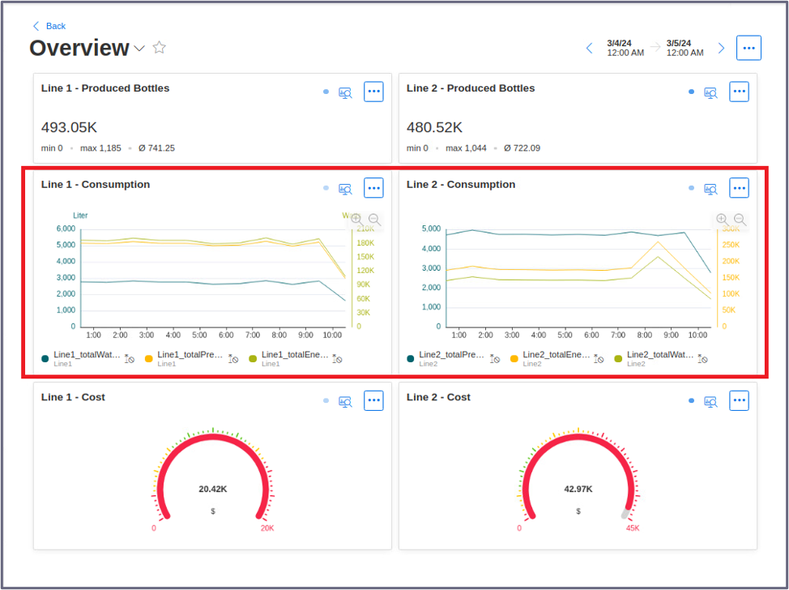
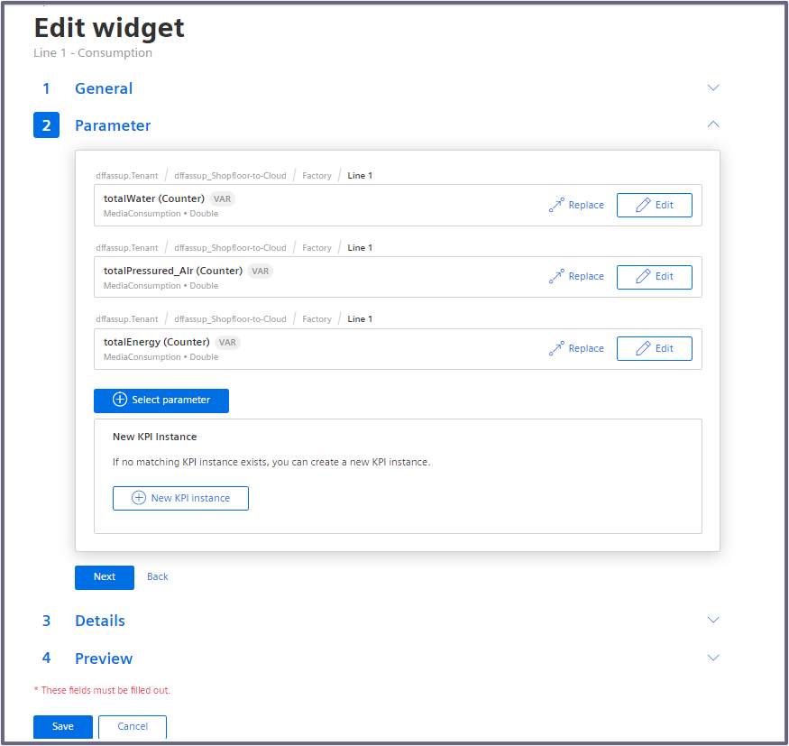
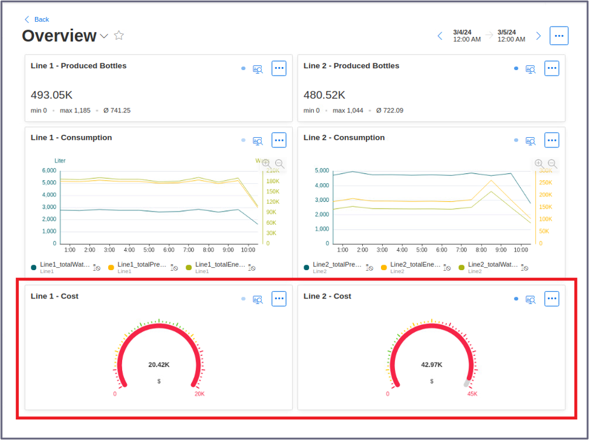
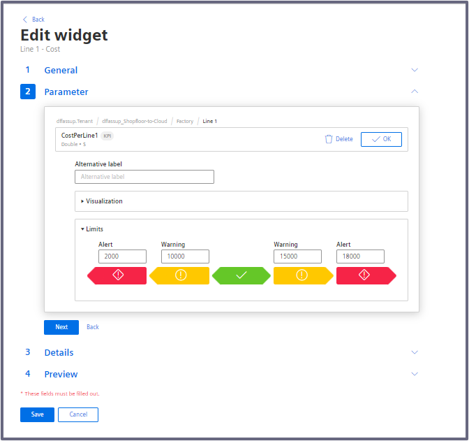

# Configuration Steps

- [Configuration Steps](#configuration-steps)
- [IIH Insights Hub Sync](#iih-insights-hub-sync)
- [Configure Energy Manager](#configure-energy-manager)
- [Navigation](#navigation)
  
# IIH Insights Hub Sync

To analyze incoming data from the Shopfloor-To-Cloud edge device in Insights Hub Cloud, you can use the Energy Manager application to create dashboards so you can process and display the supplied data.

For this, the following dashboards are created using the data collected from the Shopfloor:

1) **Overview:**
- Produced Bottles of Each Line
- Consumption Graphic of Each Line
- Cost of each Line

2) **Line 1 - Media Consumption:**
- Energy per Bottle
- Water per Bottle
- Pressured Air per Bottle
- Consumption per Bottle
- Cost per Bottle

3) **Line 2 - Media Consumption:**
- Energy per Bottle
- Water per Bottle
- Pressured Air per Bottle
- Consumption per Bottle
- Cost per Bottle

# Configure Energy Manager

From here, the step-by-step process of creating each dashboard will be explained.

## Overview Dashboard

Let's start by builidng the **Overview** dashboard. This is the final result of the dashboard:

Now, create a new dashboard by going to *My Plant*, select the asset where the variables are added, click on "Add dashboard" and name it "Overview":

### Create widget for Produced Bottles of Each Line:

Here, the creation of this section of the dashboard will be explained:

To do that, in the created dashboard, proceed to create a widget. 

Create a "Value" widget to display the Produced Bottles of the Line 1 and attach it to the "Line1_ProducedBottles", like so:

Chosse the KPI Calculation Period of your preference. Then, just click save, place the widget in the dashboard layout and repeat the same proccess for Line 2.

### Create widget for Consumption Graphic of Each Line

Here, the creation of this section of the dashboard will be explained:

To do that, create a "Diagram" widget and attach it to the following parameters:

Chosse the KPI Calculation Period of your preference. Then, just click save, place the widget in the dashboard layout and repeat the same proccess for Line 2.

### Create widget for Cost of each Line

Here, the creation of this section of the dashboard will be explained:

For this widget, the following KPI type needs to be created:

In order to do that, go to *Energy Manager UI > Configuration > KPI Types* and create a new KPI type with the information provided in the picture above.

Then, create a KPI instance named "CostLine1" based on the previously created KPI type, like so:

Now, create a "Gauge" widget and attach it to the KPI instance you just created:

Then, just click save, place the widget in the dashboard layout and repeat the same proccess for Line 2.

# Navigation

[Overview](../README.md)

[Configuration Southbound Device ](install_PLC_Devices_Southbound.md)

[Configuration Northbound Device](install_Device_Northbound.md)
