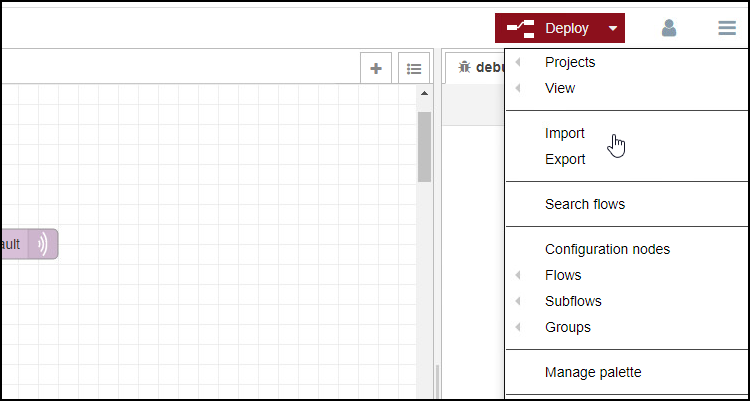

# Configuration Steps
- [Configuration Steps](#configuration-steps)
- [Configure PLC-Project in TIA-Portal](#configure-plc-project-in-tia-portal)
- [Configuration Southbound for Industrial Edge](#configuration-southbound-for-industrial-edge)
  - [Databus](#databus)
  - [OPC UA Connector](#opc-ua-connector)
  - [IE Flow Creator](#ie-flow-creator)
  - [DataXess](#dataxess)
- [Navigation](#navigation)
  

# Configure PLC-Project in TIA-Portal

1. Download the TIA portal projects [EnergyManagement_Energy1](../src/Device_Energy1/EnergyManagement_Energy1.zap16) and [EnergyManagement_Energy2](../src/Device_Energy2/EnergyManagement_Energy2.zap16)

2. Open TIA portal and open the projects containing the Energy Management application (Adapt the IP addresses to your system)
   

3. Download the PLC programs to the PLCs and set the PLCs into RUN
 
 
# Configuration Southbound for Industrial Edge

The Southbound consist of two devices. In the following they are called "Energy1" and "Energy2"

Installed Apps on the Device Energy1 and Energy2: 
  - OPC UA Connector
  - IE Cloud Connector
  - Databus
  - IE Flow Creator

## Databus

Add a user in the Databus Configurator with username and password and provide necessary access right to the required topics so the OPC UA Connector, IE Flow Creator and IE Cloud Connector can publish and subscribe to topics.

Instead of manually configuring you can also import the configuration files:

[Databus_Energy1](../src/CentralDevice/IE-Databus.json) (Password = Edge1234!)

[Databus_Energy2](../src/CentralDevice/IE-Databus.json) (Password = Edge1234!)

1. Open the Industrial Edge Management App and launch the Databus configurator, add your related credentials/topics:

   - Username: `edge`
   - Password: `edge`
   - Topic: `ie/#`
   - Permission: `Publish and Subscribe`

  

2. Deploy configuration to device

  

## OPC UA Connector

To provide data from the PLC on the Databus connect the OPC UA Connector to the PLC and add the required PLC variables

1. Launch the OPC UA Connector Configurator in the Industrial Edge Management under 'Data Connections' and configure the PLC connection 
2. Import the JSON file [energy1_OPCUA_Connector](../src/Device_Energy1/energy1_OPCUA_Connector.json) for Energy1 and [energy2_OPCUA_Connector](../src/Device_Energy2/energy2_OPCUA_Connector.json) for Energy2 
3. Adjust IP adress of the imported PLC connection
4. Deploy and start your OPC UA Connector configuration

  

## IE Flow Creator

Aggregate the raw data from the PLC to:
- Energy
- Water
- Pressured Air
- Produced Bottles 

After aggregation the data and metadata are published to IE Databus. With DataXess the data will be send to the central device.

The aggregated values are published on newly defined topics to prevent collision with OPC UA Connector related topic names

1. Import the JSON-File
  
    Energy1: [FlowCreator_Energy1](../src/Device_Energy1/FlowCreator_Energy1.json)

    Energy2:[FlowCreator_Energy2](../src/Device_Energy2/FlowCreator_Energy2.json)
  
    
  

2. Double click on a MQTT-Node  
3. Add IE Databus Credentials
  
  
  
    
  

4. Deploy the Flows

## DataXess

Explain DataXess config

# Navigation

[Overview](../README.md)

[Configuration Northbound Device](install_Device_Northbound.md)

[Configuration Insights Hub](install_MindSphere.md)
