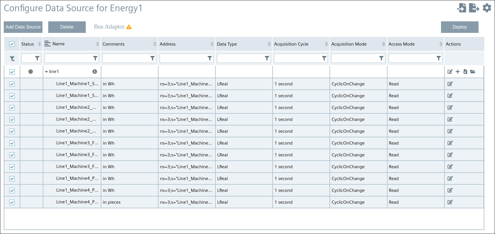

# Configuration Steps
- [Configuration Steps](#configuration-steps)
- [Configure PLC-Project in TIA-Portal](#configure-plc-project-in-tia-portal)
- [Configuration Southbound for Industrial Edge](#configuration-southbound-for-industrial-edge)
  - [Databus](#databus)
  - [OPC UA Connector](#opc-ua-connector)
  - [IE Flow Creator](#ie-flow-creator)
  - [IE Cloud Connector](#ie-cloud-connector)
- [Navigation](#navigation)
  

# Configure PLC-Project in TIA-Portal

1. Download the TIA portal projects [EnergyManagement_Energy1](../src/Device_Energy1/EnergyManagement_Energy1.zap16) and [EnergyManagement_Energy2](../src/Device_Energy2/EnergyManagement_Energy2.zap16)

2. Open TIA portal and open the projects containing the Energy Management application (Adapt the IP addresses to your system)
   

3. Download the PLC programs to the PLCs and set the PLCs into RUN
 
 
# Configuration Southbound for Industrial Edge

The Southbound consist of two devices. In the following they are called "Energy1" and "Energy2"

Installed Apps on the Device Energy1 and Energy2: 
  - OPC UA Connector
  - Common Import Converter
  - Registry Service
  - IE Cloud Connector
  - Databus
  - IE Flow Creator

## Databus

Add a user in the Databus Configurator with username and password and provide necessary access right to the required topics so the OPC UA Connector, IE Flow Creator and IE Cloud Connector can publish and subscribe to topics.

Instead of manually configuring you can also import the configuration files:

[Databus_Energy1](../src/CentralDevice/IE-Databus.json) (Password = Edge1234!)

[Databus_Energy2](../src/CentralDevice/IE-Databus.json) (Password = Edge1234!)

1. Open the Industrial Edge Management App and launch the Databus configurator, add your related credentials/topics:

   - Username: `edge`
   - Password: `edge`
   - Topic: `ie/#`
   - Permission: `Publish and Subscribe`

  

1. Deploy configuration to device

  

## OPC UA Connector

To provide data from the PLC on the Databus connect the OPC UA Connector to the PLC and add the required PLC variables. We will use the central configuration in the IEM.

1. Launch the OPC UA Connector Configurator in the Industrial Edge Management under 'Data Connections' and configure the PLC connection 
2. Import the JSON file [Energy1_OPCUA_Connector](../src/Device_Energy1/Energy1_OPCUA_Connector.json) for Energy1 and [Energy2_OPCUA_Connector](../src/Device_Energy2/Energy2_OPCUA_Connector.json) for Energy2 
3. Adjust IP address of the imported PLC connection
4. Select the PLC and deploy the configuration
   
  

## IE Flow Creator

Aggregate the raw data from the PLC to:
- Energy
- Water
- Pressured Air
- Produced Bottles 

After aggregation the data and metadata are published to IE Databus. IE Cloud Connector subscribes to these topics and sends them to the central device 

The aggregated values are published on newly defined topics to prevent collision with OPC UA Connector related topic names

1. Import the JSON-File
  
    Energy1: [FlowCreator_Energy1](../src/Device_Energy1/FlowCreator_Energy1.json)

    Energy2:[FlowCreator_Energy2](../src/Device_Energy2/FlowCreator_Energy2.json)
  
    
  

2. Double click on a MQTT-Node  
3. Add IE Databus Credentials
  
  
  
    
  

4. Deploy the Flows

## IE Cloud Connector

For the communication from Energy1 and Energy2 to the Central device configure the IE Cloud Connector. 

Instead of manually configuring you can also import the configuration files:

[CloudConnector_Energy1](../src/Device_Energy1/CloudConnector_Energy1.json) (Password = Edge1234!)

[CloudConnector_Energy2](../src/Device_Energy2/CloudConnector_Energy2.json) (Password = Edge1234!)

1. Click "Edit Configuration" and login to the Databus.

  

Configure starting from the left side "Bus Adaptor" to the right the "Cloud Connector Clients" Adapt the IP addresses to your system.

To save the configuration, initially click on your route and connect your topics from the bus adaptor with your cloud topics 

Then click on deploy.

Note: Create one topic for the data and one topic for the metadata. 

2. Add the Metadata-topic in the Bus Adaptor Field

    Energy1: `ie/m/j/simatic/v1/iefc/dp`

    Energy2: `ie/m/j/simatic/v1/iefc/dp` 
  
      
  
  
3. Add the Data-topic
   
   Energy1:
   `ie/d/j/simatic/v1/iefc/dp/r/line1/default`
  
   Energy2:
   `ie/d/j/simatic/v1/iefc/dp/r/line2/default`
    
  

"Connecting Routes" allows you to forward the data from Databus-Topics to the "Cloud Connector Clients"

4. Add Connecting Routes
  
   Energy1:
   - `central-data` 
   - `central-metadata`
  
   Energy2:
   - `central-data2`
   - `central-metadata2`
  
    
  

"Local Lake" allows you to connect a local MQTT-Broker like the External Databus 

5. Add Cloud Connector Clients
  - Type: `LOCAL_LAKE`
  
  - Publish Topic & enter the Databus credentials of the northbound device:
  
    Energy1:
    - Metadata: `ie/m/j/simatic/v1/energy1line1:iefc/dp`
    - Data: `ie/d/j/simatic/v1/energy1line1:iefc/dp/r/line1/default`
    
    Energy2:
    - Metadata: `ie/m/j/simatic/v1/energy2line2:iefc/dp`
    - Data: `ie/d/j/simatic/v1/energy2line2:iefc/dp/r/line2/default`
  
    
  
  

  
    
      
  

6. Mark the data and metadata routes an click "Save Route" 
      
        
  
    
      
  

7. Deploy your configuration

# Navigation

[Overview](../README.md)

[Configuration Northbound Device](install_Device_Northbound.md)

[Configuration Insights Hub](install_MindSphere.md)
