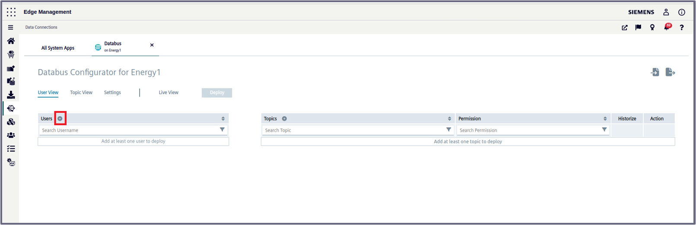

# Configuration Steps
- [Configuration Steps](#configuration-steps)
- [Configure PLC-Project in TIA-Portal](#configure-plc-project-in-tia-portal)
- [Configure PLC connections in Industrial Edge](#configure-plc-connections-in-industrial-edge)
  - [Create Databus Credentials and Topics](#create-databus-credentials-and-topics)
  - [Configure OPC UA Connector in Common Configurator](#configure-opc-ua-connector-in-common-configurator)
      - Enter Databus credentials
      - Add PLC
      - Add tags
- [Configure Data Processing](#configure-data-processing)
  - [IE Flow Creator](#ie-flow-creator)
- [Configure Connection to Northbound]
  - [DataXess](#dataxess)

# Configure PLC-Project in TIA-Portal

1. Download the TIA portal projects [EnergyManagement_Energy1](../src/Device_Energy1/EnergyManagement_Energy1.zap16) and [EnergyManagement_Energy2](../src/Device_Energy2/EnergyManagement_Energy2.zap16)

2. Open TIA portal and open the projects containing the Energy Management application (Adapt the IP addresses to your system)
   

3. Download the PLC programs to the PLCs and set the PLCs into RUN
 
 
# Configure PLC connections in Industrial Edge

The Southbound consist of two  edge devices. For this example, they are called "Energy1" and "Energy2"

Installed Apps on the Device Energy1 and Energy2: 
  - OPC UA Connector
  - Common Import Converter
  - Common Configurator
  - Registry Service
  - IIH Essentials
  - DataXess
  - Databus
  - Flow Creator

Each of the following steps are done in the Industrial Edge system and, as explained in the Reference Architecture shown in the main page, the OPC UA Connector is used on the Industrial Edge Device (IED) to read data from the PLCs and provide the data. Then, the data is sent via the connectors to the Databus.

## Create Databus Credentials and Topics

Go to the *Industrial Edge Management UI > Data Connections*, select "Databus" and launch it on the "Energy1" Edge Device.

When the configurator is open, click on the "plus" icon in the red square shown in the picture bellow to add an user: 

Add your related credentials/topics:

   - Username: `edge`
   - Password: `edge`
   - Topics: 
     - `ie/#` 
   - Permission: `Publish and Subscribe`

Click on the plus icon to add the rest of the topics:

Add the following topics:
 - `ie/d/j/simatic/v1/iefc/dp/r/#`
 - `ie/m/j/simatic/v1/iefc/dp`

Click deploy and repeat the same steps for the "Energy2" edge device.

Instead of manually configuring you can also import the configuration files:

[Databus_Energy1](../src/Device_Energy1/Databus_Energy1_config.json) (Password = Edge1234!)

[Databus_Energy2](../src/Device_Energy1/Databus_Energy1_config.json) (Password = Edge1234!)

## OPC UA Connector

To provide data from the PLC on the Databus connect the OPC UA Connector to the PLC and add the required PLC variables. We will use the central configuration in the IEM.

1. Launch the OPC UA Connector Configurator in the Industrial Edge Management under 'Data Connections' and configure the PLC connection 
2. Import the JSON file [Energy1_OPCUA_Connector](../src/Device_Energy1/Energy1_OPCUA_Connector.json) for Energy1 and [Energy2_OPCUA_Connector](../src/Device_Energy2/Energy2_OPCUA_Connector.json) for Energy2 
3. Adjust IP address of the imported PLC connection
4. Select the PLC and deploy the configuration
   
  

## IE Flow Creator

Aggregate the raw data from the PLC to:
- Energy
- Water
- Pressured Air
- Produced Bottles 

After aggregation the data and metadata are published to IE Databus. With DataXess the data will be send to the central device.

The aggregated values are published on newly defined topics to prevent collision with OPC UA Connector related topic names

1. Import the JSON-File
  
    Energy1: [FlowCreator_Energy1](../src/Device_Energy1/FlowCreator_Energy1.json)

    Energy2: [FlowCreator_Energy2](../src/Device_Energy2/FlowCreator_Energy2.json)
  
    
  

2. Double click on a MQTT-Node  
3. Add IE Databus Credentials
  
  
  
    
  

4. Deploy the Flows

## DataXess

The DataXess application will send the preprocessed data to the central device. The configuration is done centrally in the IEM and is explained in [configuration of the Northbound Device](install_Device_Northbound.md).

# Navigation

[Overview](../README.md)

[Configuration Northbound Device](install_Device_Northbound.md)

[Configuration Insights Hub](install_MindSphere.md)
