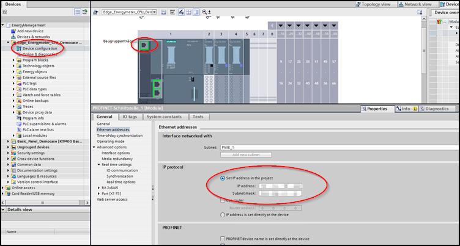
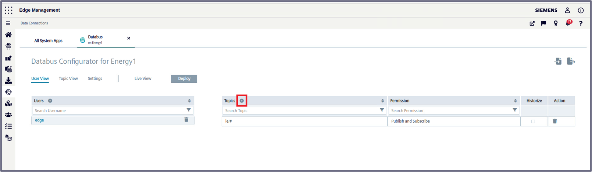
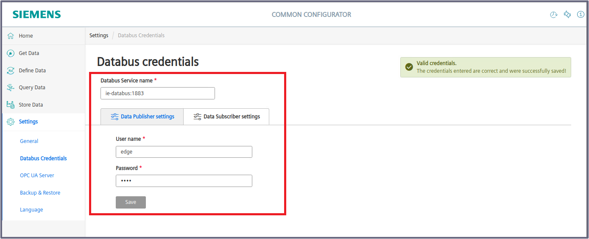
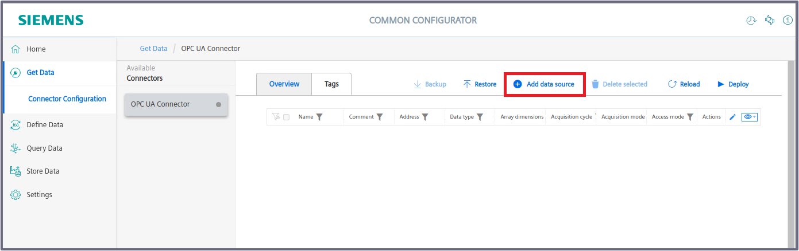

# Configuration Steps
- [Configuration Steps](#configuration-steps)
- [Configure PLC-Project in TIA-Portal](#configure-plc-project-in-tia-portal)
- [Configure PLC connections in Industrial Edge](#configure-plc-connections-in-industrial-edge)
  - [Create Databus Credentials and Topics](#create-databus-credentials-and-topics)
  - [Configure OPC UA Connector in Common Configurator](#configure-opc-ua-connector-in-common-configurator)
      - [Enter Databus credentials](#enter-databus-credentials)
      - [Add PLC](#add-plc)
      - [Add tags](#add-tags)
- [Configure Data Processing](#configure-data-processing)
  - [IE Flow Creator](#ie-flow-creator)
- [Configure Connection to Northbound]
  - [DataXess](#dataxess)

# Configure PLC-Project in TIA-Portal

1. Download the TIA portal projects [EnergyManagement_Energy1](../src/Device_Energy1/EnergyManagement_Energy1.zap16) and [EnergyManagement_Energy2](../src/Device_Energy2/EnergyManagement_Energy2.zap16)

2. Open TIA portal and open the projects containing the Energy Management application (Adapt the IP addresses to your system)
   

3. Download the PLC programs to the PLCs and set the PLCs into RUN
 
 
# Configure PLC connections in Industrial Edge

The Southbound consist of two  edge devices. For this example, they are called "Energy1" and "Energy2"

Installed Apps on the Device Energy1 and Energy2: 
  - OPC UA Connector
  - Common Import Converter
  - Common Configurator
  - Registry Service
  - IIH Essentials
  - DataXess
  - Databus
  - Flow Creator

Each of the following steps are done in the Industrial Edge system and, as explained in the Reference Architecture shown in the main page, the OPC UA Connector is used on the Industrial Edge Device (IED) to read data from the PLCs and provide the data. Then, the data is sent via the connectors to the Databus.

## Create Databus Credentials and Topics

Go to the *Industrial Edge Management UI > Data Connections*, select "Databus" and launch it on the "Energy1" Edge Device.

When the configurator is open, click on the "plus" icon in the red square shown in the picture bellow to add an user: 

Add your related credentials/topics:

   - Username: `edge`
   - Password: `edge`
   - Topics: 
     - `ie/#` 
   - Permission: `Publish and Subscribe`

Click on the plus icon to add the rest of the topics:

Add the following topics:
 - `ie/d/j/simatic/v1/iefc/dp/r/#`
 - `ie/m/j/simatic/v1/iefc/dp`

Click deploy and repeat the same steps for the "Energy2" edge device.

Instead of manually configuring you can also import the configuration file to both devices:

[Databus_Configuration](../src/Device_Energy1/Databus_Energy1_config.json) (Password = Edge1234!)

## Configure OPC UA Connector in Common Configurator

In this section, the following steps will be addressed:

- Connect the "Energy1_PLC" to the "Energy1" Edge device to retrieve tags via the OPC UA Connector.
- Connect the "Energy2_PLC" to the "Energy2" Edge device to retrieve tags via the OPC UA Connector.
  
For this example, we will only walk through the steps for Energy 1. The same steps should be repeated for "Energy2".

To provide data from the PLC to the Databus connect the OPC UA Connector to the PLC and add the required PLC variables. We will use Common Configurator to achieve this.

Go to each *Edge Device UI > Apps* and open *Common Configurator*

### Enter Databus Credentials

Go to *Settings > Databus Credentials* and enter the previously created Databus credentials:

> [!IMPORTANT]  
> If the credentials were typed correctly you should see the "Valid Credentials" pop-up label on the top right as shown in the picture.

### Add PLC

Go to *Get Data* and open the OPC UA Connector:

> [!IMPORTANT]  
> If the Databus was configured correctly, "Databus is installed" label should be checked in green.

Click on *Tags* tab and select *Add data source*:

Type your PLC information (OPC UA server) and save:

Then click "Import tags" on the just created data-source and import the JSON file [Energy1_OPCUA_Connector](../src/Device_Energy1/Energy1_OPCUA_Connector.json) for Energy1 and [Energy2_OPCUA_Connector](../src/Device_Energy2/Energy2_OPCUA_Connector.json) for Energy2.

In this case, you'll se something like this for Energy 1:

Select all the tags, enter the acquision cycle and access mode. Last, click "Import".

Now, the tags for Energy 1 are imported in the data-source. Just click "Deploy" to apply changes:

After deployment, ensure that the connector status is displayed in "green" and that the data source also shows a green status, like so:

To check if data is actually being extracted from the PLC, let's integrate IIH Essentials into Common Configurator. And after creating assets and adding the tags, data is shown:

Now, repeat the same proccess for Energy 2.

## IE Flow Creator

The data collected from the OPC UA Connector is published to the Databus, and using the Flow Creator, we retrieve this data from the Databus and send it to the central Device (Shopfloor-to-Cloud) through the DataXess application, which will be configured in the Northbound.

Please note that for the Flow Creator to function properly, the Acquisition Devices must be strictly named "Energy1" and "Energy2".

Aggregate the raw data from the PLC to:
- Energy
- Water
- Pressured Air
- Produced Bottles 

The aggregated values are published on newly defined topics to prevent collision with OPC UA Connector related topic names

To do this, follow this steps:

1. Import the JSON-File
  
    For Energy1: [FlowCreator_Energy1](../src/Device_Energy1/FlowCreator_Energy1.json)

    For Energy2: [FlowCreator_Energy2](../src/Device_Energy2/FlowCreator_Energy2.json)
  
    
  

2. Double click on a MQTT-Node  
3. Add IE Databus Credentials
  
  
  
    
  

Before deploying the flows, the following topic has to be changed to `ie/d/j/simatic/v1/opcuac1/dp/r/Energy1/default` for Energy 1 and to `ie/d/j/simatic/v1/opcuac1/dp/r/Energy2/default` for Energy 2:

4. Deploy the Flows

## Configure Connection to the Nothbound
## DataXess

The DataXess application will send the preprocessed data to the central device. The configuration is done centrally in the IEM and is explained in [configuration of the Northbound Device](install_Device_Northbound.md).

# Navigation

[Overview](../README.md)

[Configuration Northbound Device](install_Device_Northbound.md)

[Configuration Insights Hub](install_MindSphere.md)
