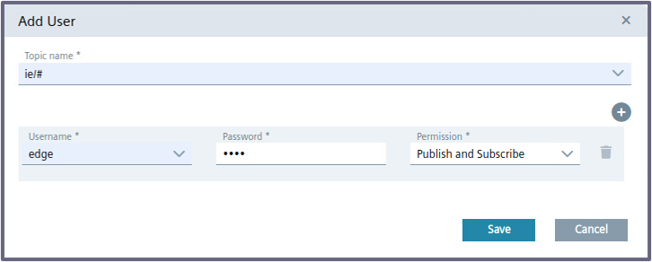

# Installation

- [Installation](#installation)
  - [Configure PLC project](#configure-plc-project)
  - [Configuration Device Energy1 and Energy2](#configuration-device-energy1-and-energy2)
    - [IE Databus](#ie-databus)
    - [SIMATIC S7 Connector](#simatic-s7-connector)
    - [IE Cloud Connector](#ie-cloud-connector)
    - [IE Flow Creator](#ie-flow-creator)
  - [Navigation](#navigation)
  

## Configure PLC project

- Open TIA portal and open the project containing the EnergyManagement application (Adapt the IP addresses to your system)
- Download the PLC program to the PLC and set the PLC into RUN
   

## Configuration Device Energy1 and Energy2

### IE Databus

Add a user in the IE Databus Configurator with username and password and provide necessary access right to the required topics so the SIMATIC S7 Connector, IE Flow Creator and IE Cloud Connector can publish and subscribe to topics.

- Launch the IE Databus Configurator and add your related credentials/topics:
`ie/#`

  

- After adding user deploy configuration to device

  

### SIMATIC S7 Connector

To provide data from the PLC on the IE Databus connect the SIMATIC S7 Connector to the PLC and add the required PLC variables

- Launch the S7 Connector and configure the PLC connection 
- Import the JSON file [energy1_S7_Connector](energy1_S7_Connector.json) for Energy1 and [energy2_S7_Connector](energy2_S7_Connector.json) for Energy2
- Deploy and start your S7 Connector configuration

  

### IE Cloud Connector

For the communication from Energy1 and Energy2 to the Central device configure the IE Cloud Connector.

- Click "Edit Configuration" and login to the Databus.

  

Configure starting from the left side "Bus Adaptor" to the right the "Cloud Connector Clients" Adapt the IP addresses to your system.

To deploy the configuration, initially click on your route and connect your topics from the bus adaptor with your cloud topics 

Then click on deploy.

Note: Create one topic for the data and one topic for the metadata. 

Instead of configure the Cloud Connector, you can also import the Configuration files:
[CloudConnector_Energy1](CloudConnector_Energy1.json)
[CloudConnector_Energy2](CloudConnector_Energy2.json)

- Add the Metadata-topic in the Bus Adaptor Field

  Energy1:
  `ie/m/j/simatic/v1/iefc/dp`
  
  Energy2:
  `ie/m/j/simatic/v1/iefc/dp` 
  
      
  
  
- Add the Data-topic
   Energy1:
  `ie/d/j/simatic/v1/iefc/dp/r/Line1/default`
  
   Energy2:
  `ie/d/j/simatic/v1/iefc/dp/r/line2/default`
    
  

- Add Connecting Routes
  
  Energy1:
  `central-data` 
  `central-metadata`
  
  Energy2:
  `central-data2`
  `central-metadata2`
  
    
  

- Add Cloud Connector Clients
  Type: `LOCAL_LAKE`
  
  Energy1:
  Data: `ie/d/j/simatic/v1/iecc/dp/r/energy1line1/raw`
  Metadata: `ie/m/j/simatic/v1/iecc/dp/energy1line1`
  
  Energy2:
  Data: `ie/d/j/simatic/v1/iecc/dp/r/energy2line2/raw`
  Metadata: `ie/m/j/simatic/v1/iecc/dp/energy2line2`
  
    
  
    
      
  

- Mark the data and metadata routs an click "Save Route" 
      
        
  
    
      
  

- Deploy your configuration

### IE Flow Creator

Aggregate the raw data from the PLC to:
- Energy
- Water
- Pressured Air
- Produced Bottles 

After aggregation the data and metadata are published to IE Databus. IE Cloud Connector subscribes to these topics and sends them to the central device 

The aggregated values are published on newly defined topics to prevent collision with SIMATIC S7-Connector

- Import the JSON-File
  
  Energy1:
  [FlowCreator_Energy1](FlowCreator_Energy1.json)
  Energy2:
  [FlowCreator_Energy2](FlowCreator_Energy2.json)
  
    
  

- Double click on a MQTT-Node  
- add IE Databus Credentials
  
  
  
    
  

- Deploy the Flows

## Navigation

[Overview](../README.md)

[Configuration Central Device](install_Device_Northbound.md)

[Configuration MindSphere](install_MindSphere.md)

